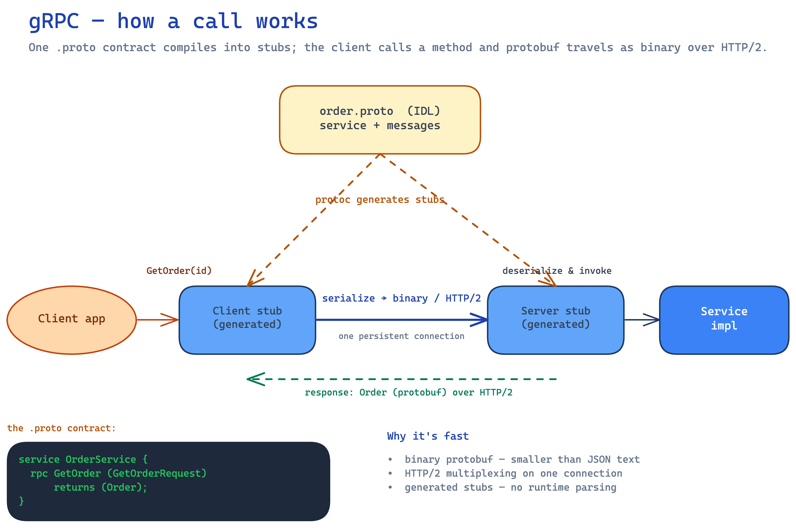

# gRPC

---

A high-performance API style for service-to-service calls. Companion to [API design](./api-design.md) and [HTTP](./http.md). Great fit for [microservices](../monolithic-vs-microservices.md).

## 1. What is gRPC?

**gRPC** is a high-performance, open-source **RPC (Remote Procedure Call)** framework from Google. You call a method on a remote server as if it were a **local function** — the framework handles serialization, transport, and connection. It's built on **HTTP/2** for transport and **Protocol Buffers** for the data format.

## 2. Protocol Buffers (protobuf)

**Protobuf** is gRPC's **IDL (Interface Definition Language)** and binary serialization format. You define the service and messages in a `.proto` file, then `protoc` **generates typed client + server code** in many languages (Java, Go, Python, …) — one contract, all languages.

```proto
service OrderService {
  rpc GetOrder (GetOrderRequest) returns (Order);
}
message GetOrderRequest { string order_id = 1; }
message Order { string id = 1; double amount = 2; }
```

Data is serialized to a **compact binary** form (field numbers, not field names) — far smaller than JSON text.

## 3. How a gRPC call works



## 4. Why is gRPC fast?

- **Binary protobuf** — smaller payloads and faster (de)serialization than text JSON.
- **HTTP/2** — multiplexes many calls over **one persistent connection**, with header compression and no head-of-line blocking at the HTTP layer.
- **Generated code** — no runtime reflection or hand-parsing; stubs are compiled.
- **Streaming** — long-lived connections stream many messages without new handshakes.

## 5. Call types

| Type | Shape |
|---|---|
| **Unary** | one request → one response (classic RPC) |
| **Server streaming** | one request → stream of responses (e.g. a live feed) |
| **Client streaming** | stream of requests → one response (e.g. upload) |
| **Bidirectional** | both stream independently (e.g. chat) |

## 6. Advantages & disadvantages

| Advantages | Disadvantages |
|---|---|
| **Fast** — binary + HTTP/2, low latency & bandwidth | **Not browser-native** — needs a **grpc-web** proxy |
| **Typed contract** — `.proto` catches mismatches at compile time | **Binary** — not human-readable; harder to debug/inspect |
| **Polyglot** — generate stubs in any language | **Steeper setup** — codegen, tooling, HTTP/2 infra |
| **Streaming** built in (4 modes) | Less ubiquitous than REST for **public** APIs |

## 7. When to use

Use gRPC for **internal service-to-service** calls where low latency, high throughput, streaming, or a strict typed contract matter (a microservices backbone). Prefer **REST/JSON** for **public / browser-facing** APIs where ubiquity and human-readability win.

## 8. One-Paragraph Summary (for quick revision)

**gRPC** is Google's high-performance **RPC** framework: call a remote method like a local function, over **HTTP/2** with **Protocol Buffers**. You define the contract in a `.proto`, and `protoc` generates **typed client stubs + server skeletons** in any language. It's fast because protobuf is **compact binary** (vs text JSON), HTTP/2 **multiplexes** over one persistent connection, and the generated code skips runtime parsing — plus four **streaming** modes (unary, server, client, bidirectional). Advantages: speed, typed contracts, polyglot, streaming; disadvantages: not browser-native (needs grpc-web), binary is hard to read/debug, and heavier setup. Reach for gRPC on the **internal microservices backbone**; keep **REST** for public, browser-facing APIs.
