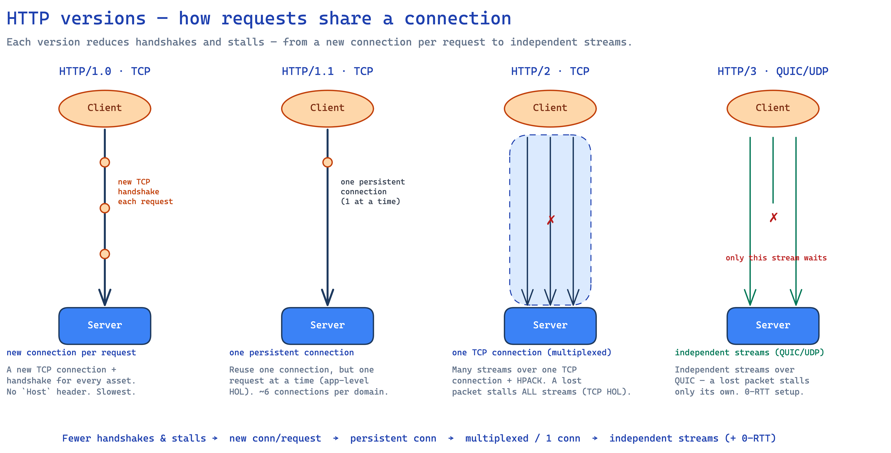

# HTTP Versions — 1.0 → 3

---

The evolution of [HTTP](./http.md) is one long fight against **latency** and **head-of-line blocking**: each version lets more requests share a connection with fewer stalls.

## 1. Overview

| Feature | HTTP/1.0 (1996) | HTTP/1.1 (1997) | HTTP/2 (2015) | HTTP/3 (2022) |
|---|---|---|---|---|
| **Transport** | TCP, new conn/request | TCP, persistent | TCP, 1 multiplexed conn | **QUIC** (UDP) |
| **Multiplexing** | No | No | Yes (streams / TCP) | Yes (independent streams) |
| **Head-of-line blocking** | Yes | Yes (app-level) | Yes (TCP-level) | **No** |
| **Header compression** | None | None | HPACK | QPACK |
| **Message format** | Text | Text | Binary framing | Binary framing |
| **Server push** | No | No | Yes | Yes |

## 2. Key terms

- **Head-of-line (HOL) blocking** — the first item in a queue stalls everything behind it. *App-level* in HTTP/1.1 (in-order responses); *transport-level* (TCP) in HTTP/2; **gone** in HTTP/3 (independent QUIC streams).
- **Multiplexing** — many requests/responses share one connection concurrently.
- **QUIC** — transport over **UDP** with built-in reliability + TLS; the basis of HTTP/3.
- **0-RTT** — resume a secure connection with no round-trip handshake.
- **HPACK / QPACK** — header compression for HTTP/2 / HTTP/3 (QPACK tolerates packet loss).
- **Connection migration** — keep a session when the client's IP changes.
- **Server push** — server sends resources before the client asks.

## 3. HTTP/1.0 (1996)

Foundational, for simple document retrieval.

- **Short-lived connections** — a new TCP 3-way handshake for **every asset** (HTML, CSS, image) → heavy latency.
- **No `Host` header** — one IP couldn't cleanly serve multiple sites (no virtual hosting).
- **Text-based** — human-readable, easy to debug by hand (Telnet).

## 4. HTTP/1.1 (1997)

Powered the web for ~two decades.

- **Persistent connections (keep-alive)** — many requests reuse **one TCP connection**, avoiding per-file handshakes.
- **Pipelining** — send requests without waiting, but the server must respond **in order** → **app-level HOL blocking**.
- **`Host` header + caching** — enables virtual hosting; adds `Cache-Control`/`ETag`.
- *Limitation:* browsers still open **~6 parallel TCP connections** per domain to work around HOL blocking.

## 5. HTTP/2 (2015)

A redesign for page-load performance.

- **Binary framing** — parsed binary frames (Headers + Data) instead of text; less overhead/ambiguity.
- **Multiplexing** — many requests/responses concurrently, out of order, over **one TCP connection** → kills *app-level* HOL blocking.
- **HPACK header compression** — Huffman + shared index table cuts repetitive header bytes.
- **Server push** — server preloads resources into the client cache (largely deprecated in practice).
- *Limitation:* **TCP HOL blocking** — one lost TCP packet stalls **all** streams until it's retransmitted.

## 6. HTTP/3 (2022)

Drops TCP to fix transport-level stalls.

- **Runs over QUIC (on UDP)** — QUIC handles reliability, congestion, and TLS 1.3 encryption in **user space**.
- **True no-HOL blocking** — QUIC streams are **independent**, so a lost packet stalls only *its* stream; others keep flowing.
- **0-RTT setup** — combines transport + crypto handshakes; returning clients reconnect with **zero round trips**.
- **Connection migration** — a **Connection ID** keeps the session alive across network changes (Wi-Fi ↔ cellular).
- **QPACK** — header compression adapted to tolerate out-of-order/lossy QUIC streams.

## 7. One-Paragraph Summary (for quick revision)

HTTP evolved to cut **latency** and **head-of-line blocking**. **HTTP/1.0** opened a new TCP connection per asset (slow, no `Host`). **HTTP/1.1** added **persistent connections**, `Host`, and caching, but pipelined responses must return in order → **app-level HOL blocking** (so browsers open ~6 connections). **HTTP/2** went **binary** with **multiplexing** (many streams over one TCP connection), **HPACK** compression, and server push — killing app-level HOL, but **TCP-level HOL** remains (one lost packet stalls all streams). **HTTP/3** moves to **QUIC over UDP**: **independent streams** (a lost packet stalls only its own), **0-RTT** setup, **connection migration** across networks, and **QPACK**. Each step lets more requests share a connection with fewer stalls.
