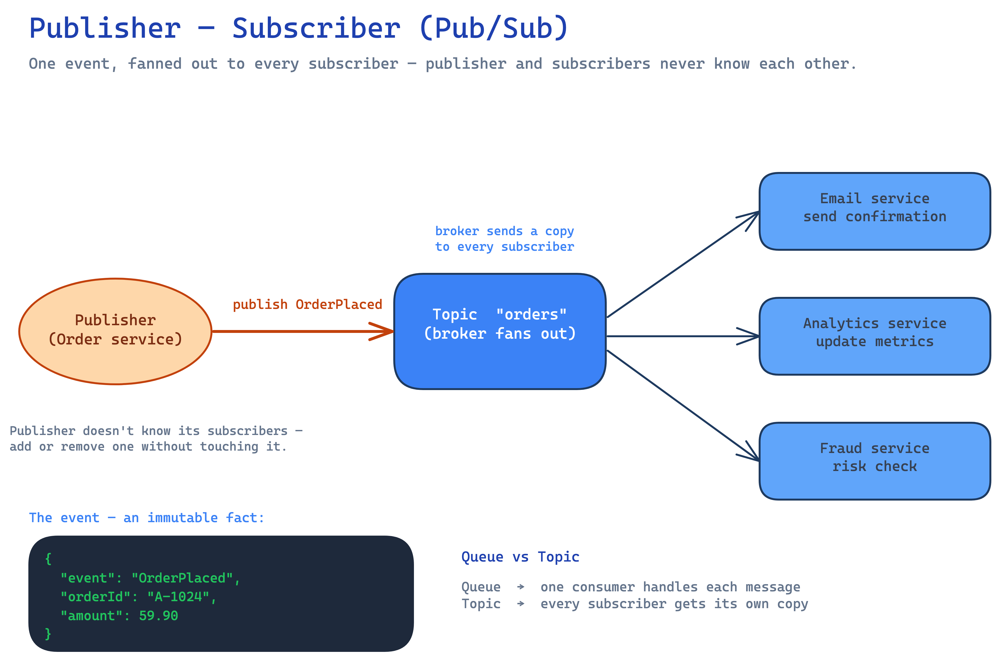

# Event-Driven Architecture

---

In **event-driven architecture (EDA)**, services communicate by **producing and reacting to events** ("something happened" — `OrderPlaced`, `PaymentFailed`) instead of calling each other directly. Producers don't know who consumes; this **decouples** services so they scale, deploy, and fail independently. Related: [message queue](./message-queue.md), [Apache Kafka](./apache-kafka.md), [microservices](./monolithic-vs-microservices.md).

## 1. Event vs command / request

An **event** is an immutable fact about the past (`UserSignedUp`), broadcast to whoever cares. A **request/command** is a directed instruction ("charge this card") expecting a response. EDA favors events → **asynchronous, loosely coupled** flows.

## 2. Publisher–Subscriber (Pub/Sub)

Publishers emit events to a **topic**; the broker delivers a copy to **every** subscriber. Publisher and subscribers are fully decoupled — neither knows the other exists.



- Add a new subscriber without touching the publisher (open for extension).
- Contrast with a point-to-point **queue** (one consumer per message). See [message queue](./message-queue.md) §3.
- **Examples:** Kafka topics, AWS SNS, Google Pub/Sub, Redis pub/sub.

## 3. Event Sourcing

Instead of storing only the **current state**, store the full **append-only log of events**; current state is derived by **replaying** them.

- **Benefits:** complete **audit trail**, time-travel/debugging, rebuild state or new read models by replaying, natural fit for EDA.
- **Costs:** more complex; querying "current state" needs a **projection** (materialized view); events are immutable so schema evolution needs care.
- Often paired with **snapshots** (periodic state checkpoints) so replay doesn't start from zero.
- **Examples:** bank ledgers, order lifecycles; stores like EventStoreDB, or a Kafka log.

## 4. CQRS (Command Query Responsibility Segregation)

Split the **write model** (commands that change state) from the **read model** (queries) — separate paths, often separate stores.

```
Command ─▶ Write model (normalized) ─event─▶ Read model(s) (denormalized) ─▶ Query
```

- **Why:** reads and writes have very different shapes/scale; optimize each independently (write = consistency; read = denormalized, fast, cacheable).
- Read models are updated **asynchronously** from events → **eventually consistent**.
- Pairs naturally with **event sourcing** (events update the read projections), but you can do either alone.
- **Cost:** two models to maintain + eventual-consistency handling; overkill for simple CRUD.

## 5. Event Streaming

A durable, ordered, **replayable log** of events that consumers process continuously — real-time pipelines rather than one-off messages.

- Differs from classic pub/sub: events are **retained** (replay, reprocess, new consumers read history) and processed as **streams**.
- **Stream processing:** filter, aggregate over **windows**, join streams — with tools like **Kafka Streams**, **Apache Flink**, **Spark Streaming**.
- **Examples:** Apache Kafka, AWS Kinesis, Apache Pulsar. See [Apache Kafka](./apache-kafka.md).

## 6. Advantages & disadvantages

| Advantages | Disadvantages |
|---|---|
| **Loose coupling** — producers & consumers evolve/deploy independently | **Eventual consistency** — no single immediate source of truth |
| **Independent scaling** — scale only the hot consumers | **Hard to trace** a flow end-to-end (needs distributed tracing) |
| **Resilience** — broker buffers; a consumer being down ≠ lost data | **Harder to debug** — async, non-linear flows |
| **Extensibility** — add a subscriber without touching producers | **Duplicate handling** — at-least-once delivery → consumers must be **idempotent** |
| **Real-time reactions** — react the moment events happen | **No simple synchronous answer** — request/response is awkward |

## 7. Real-world examples

| System | Event flow → reactions |
|---|---|
| **E-commerce (Amazon)** | `OrderPlaced` → inventory, payment, shipping, email, analytics all react |
| **Ride-sharing (Uber)** | `RideRequested` / `DriverMatched` / `TripEnded` drive matching, pricing, ETA, receipts |
| **Streaming (Netflix)** | viewing/playback events → recommendations, analytics, billing (Kafka-heavy) |
| **Payments / banking** | transaction events feed fraud detection + an **event-sourced** ledger |
| **Activity feeds (Twitter/LinkedIn)** | a post event **fans out** to followers' feeds (pub/sub) |
| **IoT & telemetry** | sensor/device streams processed in real time (Kinesis, Kafka) |

## 8. One-Paragraph Summary (for quick revision)

**Event-driven architecture** has services emit and react to **events** (immutable facts) via a broker instead of calling each other, decoupling producers from consumers. **Pub/Sub** fans one event out to every subscriber (Kafka topics, SNS). **Event sourcing** stores the append-only event log as the source of truth and derives state by **replay** (audit trail + rebuildable read models, at the cost of projections and complexity). **CQRS** splits the write model from denormalized read models updated asynchronously from events — fast reads, eventual consistency, great with event sourcing. **Event streaming** is a durable, ordered, **replayable** log processed continuously by stream processors (Kafka, Flink, Kinesis). EDA buys loose coupling, scalability, and real-time reactions, but costs eventual consistency, harder tracing/debugging, and requires idempotent consumers.
