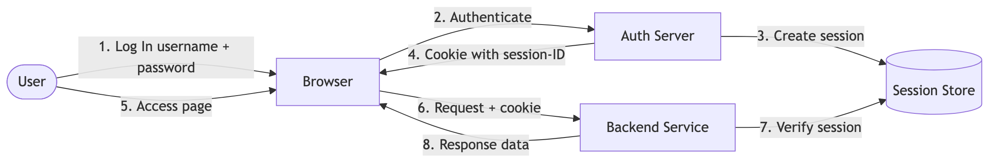
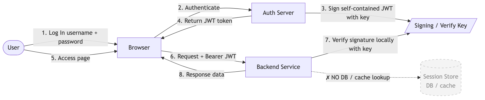

# Authentication & Authorization

---

Securing an API: proving **who** a caller is and controlling **what** they may do. Always over **TLS**. Companion to [API design](./api-design.md) and [API security](./api-security.md).

## 1. AuthN vs AuthZ

- **Authentication (authN)** = *who are you?* — verify identity (login, token, key). Failure → **401**.
- **Authorization (authZ)** = *what may you do?* — check permissions/scopes/roles. Failure → **403**.
- They're separate steps: authenticate first, then authorize each action.

## 2. Sessions vs tokens

> 📺 Quick explainer: [Session vs JWT authentication (YouTube)](https://youtu.be/fyTxwIa-1U0?si=BkgzSvLtvn_Hh9pB)

| | Server-side sessions | Tokens (stateless) |
|---|---|---|
| State | session stored server-side, cookie holds an ID | all claims in the token itself |
| Scaling | needs shared session store (sticky/Redis) | **stateless** — any server can verify |
| Revoke | delete the session (easy) | hard until expiry (needs a denylist) |

Stateless tokens fit horizontally-scaled, [stateless](../08-distributed-systems/single-point-of-failure.md) services — the common choice for APIs.

**Session-based flow** — the user logs in with **username + password**; the auth server creates a session in a **session store** and returns a **session-ID cookie**; later requests send the cookie and the server verifies it against the store before responding:



## 3. API keys

A long random secret identifying a **caller/application** (not a user), sent via header (`Authorization` or `X-API-Key`).

- **Use:** server-to-server, public data APIs, per-client rate limiting/quotas.
- **Weakness:** a static shared secret — no user identity, no expiry by default. Scope it, rotate it, send only over TLS, never in URLs/client code.

## 4. JWT (JSON Web Token)

A **self-contained, signed** token: `header.payload.signature` (base64url). The **payload** holds claims (`sub`, `exp`, `scope`); the **signature** (HMAC or RSA) lets any service verify it **without a DB lookup** — stateless authN.

- **Pros:** stateless, fast to verify, carries claims. **Cons:** can't easily revoke before `exp` (use short TTLs + a **refresh token**); don't put secrets in the payload (it's readable, only signed).

```
eyJhbGciOiJIUzI1NiJ9 . eyJzdWIiOiJ1MTIzIiwiZXhwIjox..} . <signature>
   header (alg)            payload (claims)                 verifies integrity
```

**JWT flow** — the auth server signs a **self-contained** token; later requests send it as a **Bearer token** and the backend verifies the signature **locally with a key** — **no session-store / DB / cache lookup** on each request (contrast the session-based flow in §2, which hits the store every time):



## 5. OAuth2, OIDC & SAML (delegated auth / SSO)

- **OAuth 2.0** — **delegated authorization**: an app gets a short-lived **access token** (+ refresh token) to act for a user **without the password** (default flow: Authorization Code + PKCE).
- **OIDC** — an **identity** layer on OAuth2 that adds an **`id_token`** (JWT) → "log in with Google." OAuth2 = *what you can do*; OIDC = *who you are*.
- **`access token` vs `id token`**: the access token goes to **APIs** (authorization); the id token stays in the **client** (identity) — don't send it to APIs.
- **SAML** — older **XML-based** enterprise SSO: an IdP sends a signed **assertion** to the app (SP).

Full flows, grant types, token comparison, and OIDC vs SAML: [OAuth 2.0, OIDC & SAML](./oauth-oidc-saml.md).

## 6. Other mechanisms

- **mTLS** — both client and server present certificates; strong service-to-service auth.
- **HMAC request signing** — sign the request with a shared secret (AWS SigV4 style); tamper-proof, no bearer token to steal.

## 7. When to use what

- **API key** → simple app/service identification, quotas.
- **JWT** → stateless user sessions across scaled services.
- **OAuth2 / OIDC** → third-party/delegated access and SSO (login with Google).
- **mTLS / HMAC** → high-trust service-to-service.

## 8. One-Paragraph Summary (for quick revision)

**Authentication** proves *who* you are (401 on failure); **authorization** controls *what* you can do (403). Choose **server sessions** (stateful, easy revoke) or **stateless tokens** (scale-friendly, hard to revoke) — APIs usually pick tokens. **API keys** identify an app/service (static secret — scope, rotate, TLS). **JWTs** are signed, self-contained tokens carrying claims, verifiable without a DB lookup (use short TTLs + refresh tokens; payload is readable, not secret). **OAuth2** delegates access via short-lived access tokens + refresh tokens with grant flows (Authorization Code + PKCE for users, Client Credentials for services); **OIDC** adds an identity/login layer. For high-trust service-to-service use **mTLS** or **HMAC signing**. Always over **TLS**, always least-privilege scopes.
