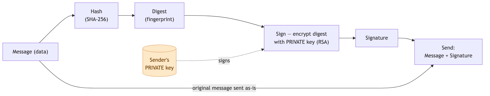
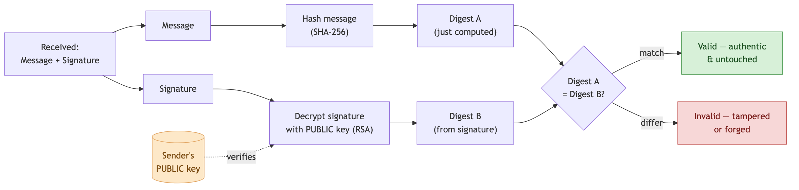

# Signing Algorithms — symmetric / asymmetric, RSA, SHA

---

Every time you log in, open an `https://` site, or an app trusts a token, three simple cryptography tools are quietly at work. No math needed to understand them — each just answers one plain question:

- **Has this been changed?** → **hashing**
- **Can other people read it?** → **encryption**
- **Who really sent this?** → **signing**

These underpin [TLS & API security](./api-security.md), [JWTs](./authentication-and-authorization.md), and [OAuth/OIDC tokens](./oauth-oidc-saml.md). Let's build them up one at a time.

## 1. The three tools at a glance

| Tool | Think of it as… | Answers |
|---|---|---|
| **Hashing** | a **fingerprint** of the data | "was this changed?" |
| **Encryption** | a **locked box** | "can others read this?" |
| **Signing** | a **wax seal / signature** | "who sent this, and is it untouched?" |

They're often combined, but each does one job. Take them in order.

## 2. Hashing — a fingerprint for data

A **hash function** takes *any* input (a word, a file, a 4 GB video) and produces a short, fixed-length string called a **digest**. The same input always gives the same digest; change even one character and the digest looks completely different.

```
SHA-256("hello") = 2cf24dba5fb0a30e26e83b2ac5b9e29e...
SHA-256("hellp") = fdd7585e08c4e2afd71dcabdb4636c89...   ← one letter changed, totally different
```

Key properties, in plain words:

- **One-way** — you can make the fingerprint from the data, but you **can't get the data back** from the fingerprint.
- **Fixed size** — a tiny input and a huge file both produce the same-length digest.
- **Same in → same out**, but **tiny change → huge change**.

**Why it's useful:** check that a downloaded file wasn't corrupted or tampered with (compare its digest to the published one), and it's the building block under signing and password storage.

**Common hash algorithms** — a *collision* (two different inputs producing the **same** digest) is what breaks a hash for security:

| Algorithm | Digest size | Status / use |
|---|---|---|
| **MD5** | 128-bit | **broken** (collisions) — only non-security checksums |
| **SHA-1** | 160-bit | **broken** — deprecated, don't use |
| **SHA-256 / SHA-512** | 256 / 512-bit | **SHA-2** — today's standard (TLS, JWT, Git) |
| **SHA-3** | 224–512-bit | newest standard, different internal design |
| **bcrypt / scrypt / Argon2** | varies | **passwords only** — deliberately slow + salted |

**Passwords need a special hash:** never store a raw password — store its hash. But normal hashes are *so fast* an attacker can guess billions per second. So use a deliberately **slow, salted** password hash — **bcrypt, scrypt, or Argon2**. A **salt** is a random value added per user, so two people with the same password still get different hashes.

## 3. Encryption — locking data so only the right person can read it

Encryption scrambles data so only someone with the **key** can unscramble it. There are two styles, and the difference is simply **how many keys**:

- **Symmetric — one shared key.** The *same* key locks and unlocks, like a house key you and a friend both have a copy of. It's **fast**. Best-known example: **AES**. The catch: how do you both get that key without someone intercepting it on the way?
- **Asymmetric — a key pair.** Two keys that belong together: a **public key** you can hand to anyone, and a **private key** you keep secret. Anything locked with the public key can only be opened with the private key. Picture handing out **open padlocks** (public) — anyone can snap one shut on a box and send it to you, but only *you* hold the key to open it. It's slower, but it **solves the key-sharing problem**. Examples: **RSA**, **ECC**.

| | **Symmetric** | **Asymmetric** |
|---|---|---|
| Keys | **one shared** key | **public** + **private** pair |
| Speed | **fast** | slower |
| Sharing the key | hard (must send it secretly) | easy (publish the public key) |
| Example | **AES** | **RSA**, **ECC** |

**ECC vs RSA:** ECC does the same job as RSA with a **much smaller key**, so it's faster — phones and modern TLS prefer it. **TLS uses both:** asymmetric to agree a shared key, then fast symmetric **AES** for the rest.

## 4. Signing — proving who sent something

A **signature** answers: *did this really come from X, and is it untouched?* It reuses the ideas above — first **hash** the message (fingerprint), then **protect that fingerprint with a key**. The receiver re-hashes the message and checks it matches. Two ways to do it:

- **HMAC (shared secret)** — mix a secret password into the fingerprint. Only people who know the secret can create *or* check the seal. Simple and fast — but both sides share the same secret, so *either* side could have produced it.
- **Digital signature (key pair)** — sign with your **private** key; anyone with your **public** key can verify. Now **only you** could have signed it (only you have the private key), yet the whole world can check. That "only the signer could have made this" property is called **non-repudiation**.

**Signing (sender side)** — hash the message into a digest, then **encrypt that digest with the sender's PRIVATE key** to produce the signature; the original message is sent alongside it:



**Verifying (receiver side)** — re-hash the received message to get **digest A**, **decrypt the signature with the sender's PUBLIC key** to recover **digest B**, then compare: **match → authentic & untouched**; **differ → tampered or forged**:



| | **HMAC** | **Digital signature** |
|---|---|---|
| Uses | one **shared secret** | **private** to sign, **public** to verify |
| Who can verify | only secret-holders | **anyone** with the public key |
| Proves *only* the sender made it? | ❌ no | ✅ yes |
| JWT name | **HS256** | **RS256** (RSA), **ES256** (ECDSA) |

**The JWT choice in one line:** use **HMAC (HS256)** when the *same* service both creates and checks the token; use a **key pair (RS256)** when *many other* services must check tokens but must **not** be able to forge them — they only receive the public key.

**A signing algorithm = a key operation + a hash.** "SHA-256" alone is **not** a signing algorithm — it's the *hash* computed first; the **key** then protects that hash. The named schemes bundle the two, and the **key type you generate decides the scheme** (you can't sign an RSA key with ECDSA):

| Key pair (you generate) | Scheme = **key op + hash** | Pick the hash? | JWT `alg` |
|---|---|---|---|
| **RSA** 2048 / 3072-bit | RSA (PKCS#1 v1.5 / PSS) **+ SHA-256** | ✅ SHA-256 / 384 / 512 | **RS256** / PS256 |
| **EC** — curve P-256 | ECDSA **+ SHA-256** | ✅ tied to curve size | **ES256** |
| **Ed25519** — edwards25519 | EdDSA **+ SHA-512 (built in)** | ❌ fixed to SHA-512 | **EdDSA** |

**Yes to all three:** RSA + SHA-256 = **`RS256`**; an EC key on **P-256** + SHA-256 = **`ES256`** (curves pair with same-size hashes — P-256↔SHA-256, P-384↔SHA-384); **Ed25519** signs with **`EdDSA`**, whose hash is **always SHA-512** — you don't choose it. So RSA/ECDSA let you *plug the hash in*, EdDSA *bakes it in*. (The "encrypt digest → decrypt signature" picture in the diagrams above is **RSA-specific**; ECDSA/EdDSA reach the same goal with different math and **don't** recover a digest.) ([RFC 7518](https://www.rfc-editor.org/rfc/rfc7518), [RFC 8032](https://www.rfc-editor.org/rfc/rfc8032))

## 5. Where you'll see these

| Use | Tool                                        |
|---|---------------------------------------------|
| `https://` / TLS | key pair to agree a key, then **AES**       |
| Storing passwords | **bcrypt / scrypt / Argon2** (slow, salted) |
| Login tokens (JWT) | **HMAC (HS256)** or **signature (RS256)**   |
| API request / webhook signing | **HMAC-SHA256** (AWS SigV4, `X-Signature`)  |

## 6. Which one do I use?

- Fingerprint / detect changes → **SHA-256**; store **passwords** → **bcrypt or Argon2** (never plain SHA).
- Keep data **secret** → **AES** within one app; **RSA/ECC** (prefer ECC) to exchange a key with a stranger.
- Prove a message is **really from you** → **sign it**: **HMAC** if both sides share a secret, **RSA/ECDSA/EdDSA** if others must verify but not forge.

## 7. One-Paragraph Summary (for quick revision)

Three tools, three questions. **Hashing** (SHA-256) makes a one-way **fingerprint** to prove data wasn't changed — great for checksums, and the base for the other two; **passwords** need a *slow, salted* hash (**bcrypt/Argon2**), never plain SHA, and MD5/SHA-1 are broken. **Encryption** locks data: **symmetric** (**AES**) uses one shared key and is fast but hard to share; **asymmetric** (**RSA/ECC**) uses a public+private pair that's easy to share — so TLS uses asymmetric to agree a key, then AES for speed. **Signing** proves *who* sent something: **HMAC** mixes in a shared secret (both sides can make it), while a **digital signature** signs with a private key that only the owner has, so anyone can verify but no one can forge (**non-repudiation**). In JWTs that's the **HS256 vs RS256** choice: HMAC when one service issues and checks tokens, a key pair when many services must verify but not forge.
