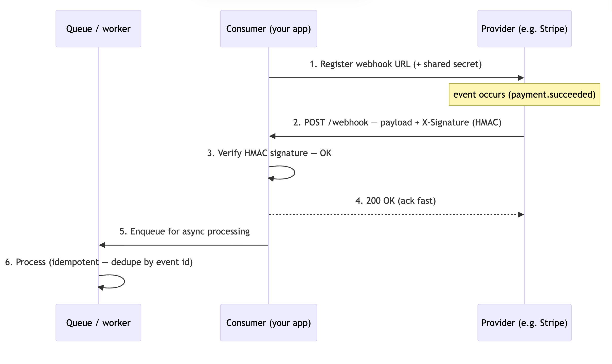
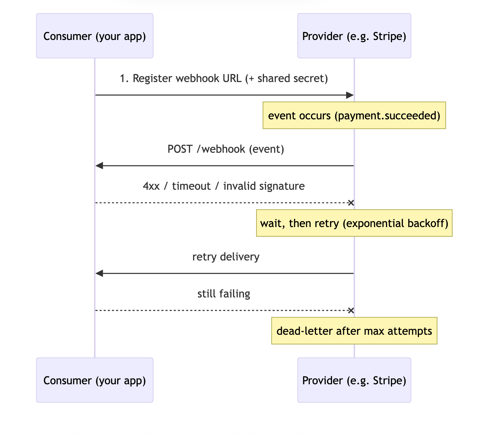

# Webhooks

---

A **reverse API**: instead of the client polling for changes, the server **calls the client** when an event happens. The HTTP-level building block of [event-driven](../07-messaging-and-events/event-driven-architecture.md) integrations. Companion to [API design](./api-design.md).

## 1. What is a webhook?

A **webhook** is a user-registered URL that a provider sends an HTTP `POST` to when an event occurs (`payment.succeeded`, `build.failed`). The consumer runs an endpoint that receives these callbacks — push, not pull.

**Happy path** — signature valid, processed asynchronously:

**Failure path** — bad response or timeout, so the provider retries then dead-letters:

## 2. Webhooks vs polling

| | Polling | Webhooks |
|---|---|---|
| Who initiates | client asks repeatedly | server pushes on event |
| Latency | delayed (poll interval) | near real-time |
| Efficiency | wasteful (mostly empty) | only fires on change |
| Cost | client bears it, always on | event-driven |

Poll when you can't expose an endpoint or events are frequent/continuous ([streaming](../07-messaging-and-events/apache-kafka.md) fits better then); use webhooks for occasional, real-world events.

## 3. Designing a reliable webhook

- **Verify authenticity** — sign the payload with an **HMAC** (`X-Signature` header + shared secret); the consumer recomputes and compares. Rejects spoofed calls.
- **Retries + idempotency** — networks fail, so providers **retry** (with backoff). The consumer must be **idempotent** (dedupe on an event ID) so a redelivered event isn't processed twice.
- **Respond fast (2xx), process async** — ack immediately, then do the work off a [queue](../07-messaging-and-events/message-queue.md); slow handlers cause timeouts + retries.
- **Ordering** — events may arrive out of order; use timestamps/sequence numbers, don't assume order.
- **Dead-lettering** — after max retries, park undeliverable events for inspection.

## 4. Real-world examples

Stripe (payment events), GitHub (push / PR events → CI), Slack (event callbacks), Twilio (SMS status), CI/CD pipelines.

## 5. One-Paragraph Summary (for quick revision)

A **webhook** is a "reverse API" — the provider `POST`s to a **client-registered URL** the moment an event happens, replacing wasteful **polling** with near-real-time push (use polling only when you can't host an endpoint, and streaming for continuous high-volume feeds). Design them for the unreliable network: **verify authenticity** with an **HMAC signature**, expect **retries** so consumers are **idempotent** (dedupe by event ID), **respond 2xx fast and process async** off a queue, don't assume **ordering**, and **dead-letter** events that exhaust retries. Ubiquitous in practice — Stripe, GitHub, Slack, Twilio, CI/CD — and the HTTP counterpart to event-driven architecture.
