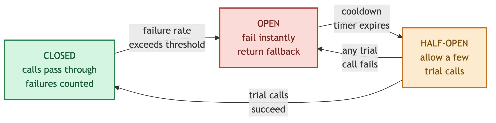

# Resilience Patterns — timeouts, retries, circuit breakers

---

In a distributed system, **dependencies will fail** — a downstream service slows down, a network blips, a node dies. Resilience patterns are the client-side defenses that stop *one* slow or failing dependency from **cascading** into a system-wide outage. They're the deep dive on the "eliminate cascading failures" line in [single point of failure](../08-distributed-systems/single-point-of-failure.md), and they lean on [consistency](../08-distributed-systems/consistency-models.md) (idempotency) and [rate limiting](../03-networking-and-delivery/load-balancing-and-consistent-hashing.md).

## 1. The failure they prevent — cascading collapse

A slow dependency is worse than a dead one. If service A calls B and B hangs, A's threads **block waiting**, its thread pool fills, and A stops serving *everyone* — including callers that never needed B. The failure **propagates upstream** until the whole system is down. The patterns below cap that blast radius: fail **fast**, fail **isolated**, and **recover** automatically.

## 2. Timeouts — the non-negotiable foundation

Every remote call must have a **timeout**. Without one, a hung dependency blocks a caller thread forever — the root cause of most cascades.

- Set it from the dependency's **p99 latency + headroom**, not a guess; a 30 s default is almost always wrong.
- Use **deadlines / time budgets** across a call chain: pass "you have 200 ms left" downstream so a request doesn't retry past the point the user gave up.
- A timeout **frees the thread** to serve other work — that alone prevents most thread-pool exhaustion.

## 3. Retries — with backoff, jitter, and idempotency

Retrying masks **transient** faults (a dropped packet, a brief GC pause). Done naively it makes an overload **worse**.

| Rule | Why |
|---|---|
| **Exponential backoff** | wait 1s, 2s, 4s… — don't hammer a struggling service |
| **Add jitter** (randomize the delay) | stops all clients retrying in lockstep → a **retry storm / thundering herd** |
| **Cap attempts** (e.g. 3) | infinite retries turn a blip into a self-inflicted DDoS |
| **Only retry idempotent ops** | retrying a non-idempotent `POST` can **double-charge**; use an idempotency key |
| **Only retry retryable errors** | retry `503`/timeout, **never** `400`/`403` — those fail again identically |

**Retry budget:** cap retries to a small % of total traffic; when a dependency is broadly down, retries add load exactly when it can least handle it.

## 4. Circuit breaker — stop calling a dead dependency

A circuit breaker wraps a dependency and **stops calling it** once it's clearly failing, so callers fail fast instead of piling onto timeouts. It's a state machine:

| State | Behavior | Transition |
|---|---|---|
| **Closed** | calls pass through; failures are counted | failure rate exceeds threshold → **Open** |
| **Open** | calls **fail instantly** (no network attempt), return a fallback | after a cooldown timer → **Half-Open** |
| **Half-Open** | let a **few trial calls** through | they succeed → **Closed**; any fail → back to **Open** |

This gives the failing dependency **room to recover** (no traffic hammering it) and keeps the caller's threads free. Pair it with a **fallback** — the value in the "Open" cell.

## 5. Complementary patterns

| Pattern | What it does |
|---|---|
| **Bulkhead** | isolate resources (separate thread pools / connection pools per dependency) so one saturated dependency can't drain the shared pool — like watertight ship compartments |
| **Fallback / graceful degradation** | on failure, return a **default, cached, or reduced** response (stale data, "recommendations unavailable") instead of an error |
| **Load shedding** | when overloaded, **reject low-priority requests early** to protect the critical path |
| **Rate limiting / throttling** | cap inbound request rate so a traffic spike can't exhaust capacity |
| **Health checks + failover** | route away from unhealthy nodes (ties back to [SPOF](../08-distributed-systems/single-point-of-failure.md)) |

## 6. Real-world implementations

| Where | Tools |
|---|---|
| **Libraries** | **Resilience4j** (Java, current standard), **Polly** (.NET), Netflix **Hystrix** (Java, now retired), **gRPC** built-in deadlines/retries |
| **Service mesh** (out-of-code) | **Istio / Envoy**, **AWS App Mesh** — timeouts, retries, circuit breaking configured at the proxy, no app code |
| **SDK defaults** | **AWS SDK** clients ship with exponential backoff + jitter and retry budgets built in |

**Trend:** push these concerns *down* into a **service mesh sidecar** so every service gets them uniformly, language-agnostic.

## 7. When & how to apply — and pitfalls

- **Always:** timeouts on every remote call, capped retries with backoff **+ jitter**, circuit breakers on cross-service calls.
- **Test it:** verify breakers trip and fallbacks fire under real failure — **chaos engineering** (Chaos Monkey), fault injection.
- **Pitfalls:** retries without jitter → **retry storms**; retrying non-idempotent writes → **duplicates**; timeout longer than the caller's own timeout → useless; a fallback that silently hides a real outage → **monitor breaker state**.

## 8. One-Paragraph Summary (for quick revision)

**Resilience patterns** are client-side defenses that stop one slow or failing dependency from **cascading** into a full outage — a *slow* dependency is worse than a dead one because it blocks caller threads until the whole system stalls. The foundation is a **timeout** on every remote call (sized from p99, with cross-chain **deadlines**) so threads are freed. **Retries** mask transient faults but must use **exponential backoff + jitter**, a **capped attempt count** and **retry budget**, and apply **only to idempotent, retryable** operations — otherwise they cause retry storms and double-writes. A **circuit breaker** (Closed → Open → Half-Open) stops calling a clearly-failing dependency, failing fast with a **fallback** and giving it room to recover. Complementary patterns: **bulkheads** (isolate thread pools), **graceful degradation**, **load shedding**, and **rate limiting**. In practice use **Resilience4j / Polly**, or push it into a **service mesh** (**Istio/Envoy**, **AWS App Mesh**); **AWS SDK** clients backoff by default. Then **test failure** with chaos engineering and **monitor breaker state** so a fallback never hides a real outage.
