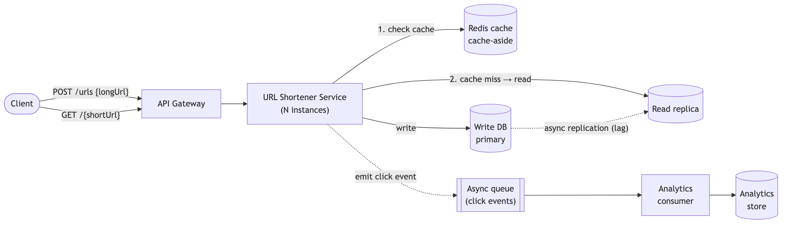

# Session 01 — Design a URL Shortener (bit.ly / TinyURL) · ⚠️ 5.9/10

> A scored, analyzed system-design mock interview: the problem, the design I produced, the interviewer's scorecard, and — most usefully — **exactly which gaps cost points and how to close them.**

| | |
|---|---|
| **Problem** | Design a URL shortening service (bit.ly / TinyURL) |
| **Focus** | read-heavy key-value store + click analytics, high availability, low-latency redirects |
| **Overall** | **5.9 / 10** — ⚠️ Borderline |
| **Weakest axes** | Communication (5.5), Scale & Trade-offs (5.5) |
| **Full transcript** | [`script.md`](./script.md) (raw interview log) |

## The problem

> Design a URL shortening service like bit.ly or TinyURL that can handle **billions of URLs**, provide **analytics**, and ensure **high availability and low latency for redirects**.

## Requirements I scoped

- **Functional:** `createShortUrl(longUrl) → shortUrl` and `resolve(shortUrl) → longUrl`. Analytics: click counts, share of URLs actually used, cleanup of stale URLs.
- **Non-functional:** high availability, low read latency (p95), fault tolerance.
- **Miss:** analytics was named in the prompt but explored late and thinly — it should have been a first-class requirement from the start.

## Back-of-the-envelope estimation

- ~1B URLs/year ÷ ~10⁵ s/day ÷ 365 → **~3 writes/sec**.
- Assumed **100:1 read:write** → **~300 reads/sec**. → confirms this is a **read-heavy** system, so caching and read replicas drive the design.

## The design I produced

- **Write path:** `Client → API Gateway → URL Shortener Service → persist mapping → return shortUrl`. Key = the **DB-generated ID** (chosen to sidestep hash collisions).
- **Read path:** service checks **Redis (cache-aside)** first; on miss, reads the **read replica**, populates the cache, returns.
- **Availability:** write DB **primary → read replica** with **leader-election failover** (a replica is promoted if the primary dies).
- **Analytics:** redirects **emit click events to an async queue**; a separate consumer aggregates them — keeping analytics off the latency-critical redirect path.

## Scorecard

| Axis | Score |
|---|:--:|
| Requirements Gathering | 6.0 |
| Design Skills | 6.0 |
| Problem-Solving | 6.5 |
| Scalability & Trade-offs | 5.5 |
| Communication | 5.5 |
| **Overall** | **5.9** |

## What lost points — and the fix

| Gap in the room | The senior answer | Study |
|---|---|---|
| **Key generation stayed shallow** — hashing, hand-waved collisions ("keep the rate low"); missed that sequential DB IDs are **guessable** | Compare hashing+collision handling vs **base62 of a counter** vs **pre-generated key pool**; call out predictable-ID **security** risk | *(todo: unique ID generation)* |
| **Wrong redirect status code** — answered 202/200/404 | **3xx** — **301** (permanent, cacheable) vs **302** (temporary, better for analytics) | [HTTP](../../concepts/04-apis/http.md) |
| **Consistent hashing needed heavy prompting** — went vertical-first for the cache | Reach for **consistent hashing** directly to shard the distributed cache/DB | [Consistent Hashing](../../concepts/03-networking-and-delivery/load-balancing-and-consistent-hashing.md) · [Sharding](../../concepts/05-databases-and-storage/sharding-and-partitioning.md) |
| **Data model ignored analytics** | Add click count, user-agent, referrer, timestamp — **design the schema for the use cases** | [Databases](../../concepts/05-databases-and-storage/databases-fundamentals.md) |
| **No cache eviction story** | Know **LRU/LFU + TTL** and invalidation for expired URLs | [Caching](../../concepts/06-caching/caching.md) |

## What went well

Systematic functional-requirements breakdown · clean read/write throughput math · solid grasp of read replicas, cache-aside, and DB failover · async analytics to protect redirect latency · sound reasoning about the replication-lag trade-off.

## Takeaways to drill

1. **Open with a visible requirements checklist** (functional / non-functional / analytics) before designing.
2. **Reach for the standard tool directly** — consistent hashing for a distributed cache, not vertical-scaling-first.
3. **Go deep on the interesting decision** (key generation) with 2–3 options and their trade-offs.
4. **Label every diagram arrow** (data + protocol) and put API signatures on the canvas.

→ Consolidated feedback across all sessions lives in the [practice tracker](../README.md). Rehearse with the [Answer Framework](../answer-framework.md) before the next mock.
