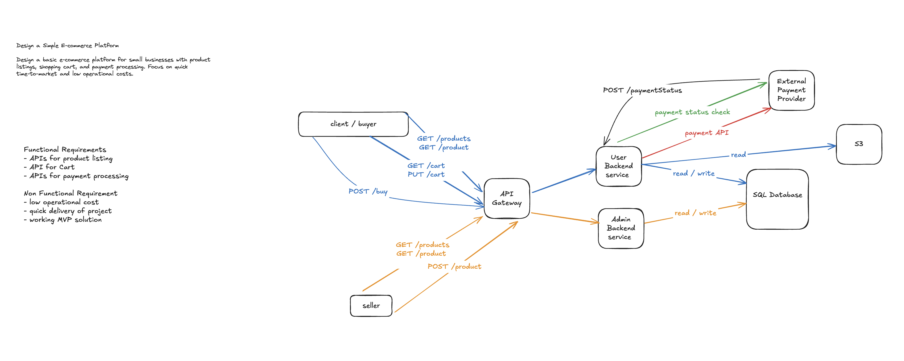

# Session 02 — Design a Basic E-commerce Platform · ⚠️ 6.6/10

> A scored, analyzed system-design mock interview: the problem, the design I produced, the interviewer's scorecard, and — most usefully — **exactly which gaps cost points and how to close them.**

| | |
|---|---|
| **Problem** | Design a basic e-commerce platform for small businesses (listings, cart, payments) |
| **Focus** | quick time-to-market + low operational cost; ~5k–10k users (scalability deprioritized) |
| **Overall** | **6.6 / 10** — ⚠️ Borderline (interviewer verdict: **FAIL** — depth below the senior bar) |
| **Weakest axes** | Scale & Trade-offs (6.0), Communication (6.0) |
| **Full transcript** | [`script.md`](./script.md) (raw interview log) |

## The problem

> Design a basic e-commerce platform for small businesses with **product listings, shopping cart, and payment processing**. Focus on **quick time-to-market and low operational costs.**

## Requirements I scoped

- **Functional:** product-listing API, shopping-cart experience, payment-processing API. Split later into a **buyer** surface (`GET /products`, `GET /product`, `GET /cart`, `PUT /cart`, `POST /buy`) and a **seller** surface (`POST /product`).
- **Non-functional:** low operational cost, quick delivery. I made the **explicit, defensible trade-off** to *deprioritize scalability* given the constraints and the small user base.
- **Miss:** never pinned numbers (products, orders/sec, SLAs) or **user roles / authentication** — the interviewer flagged both as under-explored.

## Back-of-the-envelope estimation

- Scoped to **5,000–10,000 max users** — deliberately small, so the design targets a single-box monolith rather than a fleet.
- **Gap:** no QPS / storage / read:write math. Even a throwaway "catalog is read-heavy, ~100:1 reads:writes" would have *pre-justified* the caching and read-replica discussion instead of reaching for them reactively.

## The design I produced

- **Start monolith, split later:** reasoned aloud that catalog + cart + payment could be **one service for quick delivery**, split as scale demands — then drew a split by **audience**: a **User (buyer) Backend Service** and an **Admin (seller) Backend Service** behind an **API Gateway**.
- **Storage:** a single **SQL database** (data is structured/relational); **S3** for product images, read on the `GET /products` path.
- **Browse path:** `GET /products` → user backend → SQL → list (name, description, price); `GET /product` → detail + image from S3.
- **Purchase path (`POST /buy`):** validate stock in SQL → write a purchase record with **status = pending** → call the **external payment provider** → on confirmation, decrement quantity / update catalog → return success.
- **Failure recovery:** if the backend crashes *after* payment but *before* the DB update, an **async reconciliation job** polls pending payments via a **payment-status-check** call to the provider and settles them.

## Scaling discussion (prompted)

- **Read-heavy catalog** → **read replicas** (writer + reader); called out **replication lag** → a sold-out item can still show as buyable (stale read).
- **Backend services** scale out horizontally.
- **Payment-provider connection exhaustion** (blocking on the provider) → **webhook**: the provider calls *our* endpoint on completion instead of us holding a connection.
- **Async confirmation → notify the buyer** with **SSE** (server-push, unidirectional) since the response is no longer synchronous.

## Scorecard

| Axis | Score |
|---|:--:|
| Requirements Gathering | 7.0 |
| Design Skills | 7.0 |
| Problem-Solving | 7.0 |
| Scalability & Trade-offs | 6.0 |
| Communication | 6.0 |
| **Overall** | **6.6** |

> Secondary rubric: Technical **2/4** · Problem-Solving **3/4** · Communication **2/4** → **Pass/Fail: FAIL.** Borderline on the 5-axis scale, but the interviewer set the senior bar higher: the missing security/caching/data-modeling depth and the stale diagram were disqualifying.

## What lost points — and the fix

| Gap in the room | The senior answer | Study |
|---|---|---|
| **No data model / schema** — components named, tables never drawn | Sketch `products`, `carts`, `cart_items`, `orders`, `payments` with keys + the `pending → success/failed` payment state machine | [Databases](../../concepts/05-databases-and-storage/databases-fundamentals.md) |
| **No security** — buyer vs seller auth never addressed | **AuthN + role-based authZ**: only sellers hit `POST /product`; buyers own their cart/orders | [AuthN & AuthZ](../../concepts/04-apis/authentication-and-authorization.md) · [API Security](../../concepts/04-apis/api-security.md) |
| **No caching for a read-heavy catalog** | **Cache-aside (Redis)** on `GET /products`/`GET /product`; TTL + invalidation on price/stock change | [Caching](../../concepts/06-caching/caching.md) |
| **No CDN for images** | Serve S3 product images through a **CDN**, not straight from the bucket on every read | [CDN](../../concepts/03-networking-and-delivery/cdn.md) |
| **Missed the key edge case** — concurrent purchases of last-in-stock item | Guard the decrement: **atomic conditional update / row lock / optimistic version** so two buyers can't both win the last unit | [Consistency Models](../../concepts/08-distributed-systems/consistency-models.md) |
| **Diagram went stale** — webhook/SSE discussed but never drawn | Treat the canvas as the **living artifact** — update it the moment a component enters the conversation | — |
| **Split rationale was thin** — buyer/seller split asserted, not justified | Justify a split by **independent scaling / blast-radius / different access patterns**, or defend staying monolith | [Monolith vs Microservices](../../concepts/02-foundations/monolithic-vs-microservices.md) |

## What went well

Pragmatic requirements scoping with a **defensible trade-off** (delivery over scale) · monolith-first instinct with a stated split path · clean REST endpoint design on the canvas · **strong failure handling** (pending-status + async reconciliation) · sound bottleneck reasoning (read replicas, replication-lag staleness, connection exhaustion → webhook, SSE for async notify).

## Takeaways to drill

1. **Cover the "silent" senior axes unprompted** — security/auth, caching, data model. They aren't in the prompt, but their *absence* is what failed this session.
2. **Always draw the data model** — a schema + the payment state machine is the fastest way to earn Design points.
3. **Hunt the concurrency edge case** — "what if two buyers grab the last unit?" should be reflexive on any inventory/stock design.
4. **Keep the diagram live** — every new component (webhook, SSE, cache, CDN) goes on the canvas *as you say it*.
5. **Anchor with one estimate** — even a rough read:write ratio pre-justifies caching and replicas.

→ Consolidated feedback across all sessions lives in the [practice tracker](../README.md). Rehearse with the [Answer Framework](../answer-framework.md) before the next mock.
