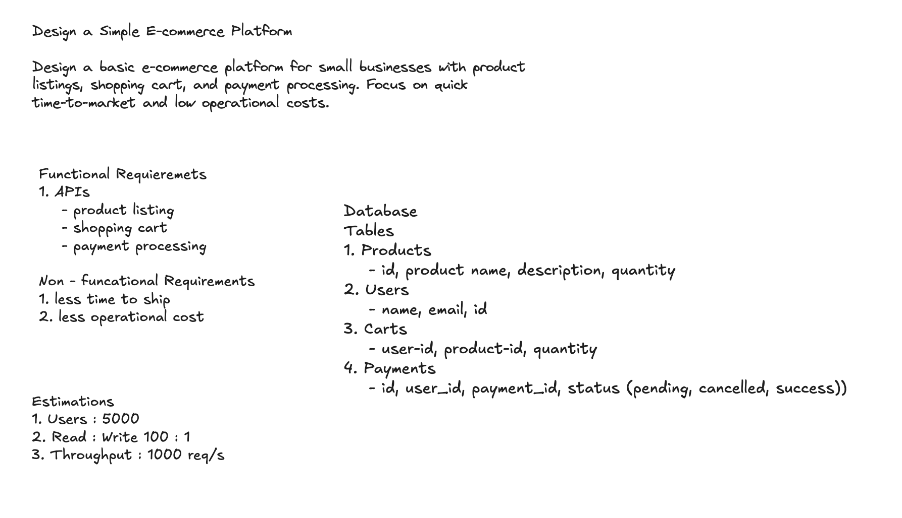

# Session 03 — E-commerce Platform (Re-attempt of S02) · ⚠️ 6.5/10

> A scored, analyzed system-design mock — this one a **deliberate re-solve of the [Session 02](../02-session/README.md) problem** after drilling its gaps. The interest isn't the score; it's the **delta**: which S02 blind spots closed, and which survived a second pass.

| | |
|---|---|
| **Problem** | Design a basic e-commerce platform for small businesses (listings, cart, payments) — *same prompt as S02* |
| **Focus** | quick time-to-market + low operational cost; MVP scale |
| **Overall** | **6.5 / 10** — ⚠️ Borderline, but interviewer verdict **Lean Hire** (S02 was **FAIL**) |
| **Weakest axes** | Problem-Solving (6.0), Scale & Trade-offs (6.0), Communication (6.0) |
| **Full transcript** | [`script.md`](./script.md) (raw interview log) |

## The problem

> Design a basic e-commerce platform for small businesses with **product listings, shopping cart, and payment processing**. Focus on **quick time-to-market and low operational costs.**

## What changed since Session 02

This was a re-attempt to prove the [How-to-Improve plan](../README.md#how-to-improve) works. It mostly did — the "silent senior axes" that sank S02 were **surfaced unprompted this time**, and that alone moved the verdict from FAIL to Lean Hire.

| S02 gap (what failed it) | S03 outcome |
|---|---|
| No estimation numbers | ✅ **Fixed** — 5,000 users, **100:1 read:write**, **~1000 RPS** peak, stated up front |
| No data model / schema | ✅ **Fixed** — drew Products / Users / Carts / Payments with fields (see canvas) |
| No caching for read-heavy catalog | ✅ **Fixed** — **Redis** + **LFU** for hot products, with invalidation reasoning |
| No CDN for images | ✅ **Fixed** — **CDN** in front of S3, invalidate cache-key on image update |
| No security / auth | 🟡 **Partial** — **Auth Module** drawn, buyer-vs-seller authZ verbalized; **payment-data / PCI still untouched** |
| Concurrent-last-unit race | ❌ **Still missed** — flagged again; Problem-Solving *dropped* 7 → 6 for it |
| Diagram lagged the talk (stale) | 🟡 **Traded** — kept live this time, but went **visually cluttered** (overlapping arrows) |

## Requirements & estimation

- **Functional:** three API groups — product listing, shopping cart, payment processing. Buyer surface (`GET /products`, `GET /product`, `GET /cart`, `PUT /cart`, `POST /buy`) vs seller surface (`POST /product`).
- **Non-functional:** low operational cost (fewer components), quick time-to-ship.
- **Estimation (the S02 fix):** 5,000 users · 100:1 read:write (browse ≫ buy) · ~1,000 concurrent peak users → **~1,000 RPS**. This *pre-justified* the caching and read-replica discussion instead of reaching for it reactively.

## The design I produced

- **Modular monolith:** one deployed service with **User Backend**, **Admin Backend**, and **Auth Module** modules (different ports/endpoints) — keeps operational cost low while separating buyer/seller concerns. Defended staying monolithic when the interviewer probed splitting.
- **Auth:** the **Auth Module inside the backend** does authN + role-based authZ — a buyer can read the catalog but not `POST /product`; sellers can.
- **Storage:** **PostgreSQL** (relational, structured) + **S3** for images. **Redis (LFU)** caches hot products. **CDN** fronts S3 images.
- **Browse path:** `GET /products` → auth → user backend → cache → DB; images served via CDN, not S3-on-every-read.
- **Purchase path (`POST /buy`):** validate inventory → initiate `POST /transaction` to **Stripe** → Stripe processes, then calls back via **webhook (`POST /txnStatus`)** → backend updates payment status in DB → pushes result to buyer over **SSE** (`tx completed/cancelled`).
- **Cache consistency:** chose **write-to-DB-first, then update cache** (rejected write-through when probed); on a cache-update failure, **retry with exponential backoff** → eventual consistency, acceptable for MVP.
- **CDN invalidation:** on image update, write S3 → **invalidate the CDN cache key** so the next read fetches fresh.

## Data model (drawn — the S02 fix)

| Table | Fields | Note |
|---|---|---|
| Products | id, name, description, quantity | `quantity` is the inventory count |
| Users | id, name, email | |
| Carts | user_id, product_id, quantity | maps a user → products + qty |
| Payments | id, user_id, payment_id, external_payment_id, **status** | status ∈ `pending / cancelled / success`; `external_payment_id` for Stripe reconciliation |

**Gap:** a **Payments table but no Orders table** — nothing records *what* was purchased (line items, totals, fulfillment state) after checkout succeeds. Payment ≠ order.

## Scorecard

| Axis | S02 | **S03** | Δ |
|---|:--:|:--:|:--:|
| Requirements Gathering | 7.0 | **7.0** | — |
| Design Skills | 7.0 | **7.0** | — |
| Problem-Solving | 7.0 | **6.0** | ▼ 1.0 |
| Scalability & Trade-offs | 6.0 | **6.0** | — |
| Communication | 6.0 | **6.0** | — |
| **Overall** | **6.6** | **6.5** | ▼ 0.1 |
| **Verdict** | FAIL | **Lean Hire** | ▲ |

> The numeric overall barely moved, but the **verdict flipped** — because the axes are scored against a *senior bar* of expected coverage, and S03 covered the schema/caching/CDN/auth that were disqualifying by their absence in S02. The score didn't rise mainly because **Problem-Solving regressed** on the still-missed concurrency edge case.

## What lost points — and the fix

| Gap in the room | The senior answer | Study |
|---|---|---|
| **Concurrent last-unit race** (missed *again*) — no inventory guard during the payment window | Two buyers hit `POST /buy` on the last unit: guard the decrement with an **atomic conditional update / row lock / optimistic version**, or **reserve stock** for the payment window and release on timeout | [Consistency Models](../../concepts/08-distributed-systems/consistency-models.md) |
| **No Orders table** — Payments captured, but not *what was bought* | Add **`orders` + `order_items`** (line items, qty, price-at-purchase, fulfillment status); payment references the order | [Databases](../../concepts/05-databases-and-storage/databases-fundamentals.md) |
| **Payment-data security untouched** — no PCI / tokenization mention | Never store raw card data — **tokenize via Stripe**; call out PCI scope reduction as the reason you use an external provider | [API Security](../../concepts/04-apis/api-security.md) |
| **Cluttered diagram** — live this time, but overlapping arrows | Separate **read vs write flows**, color per journey, space components; the canvas is the artifact the interviewer reads | — |
| **Scaling stopped at the first bottleneck** | Name the **2nd/3rd** bottlenecks: **horizontal scale** of the backend behind the LB, **DB sharding**, **rate limiting** at the gateway, connection pooling | [Load Balancing](../../concepts/03-networking-and-delivery/load-balancing-and-consistent-hashing.md) |
| **Webhook-never-arrives** failure not handled | Reconcile with a **poll/`txnStatus` fallback** job on stuck `pending` payments (this was *stronger* in S02 — regained ground worth keeping) | — |

## What went well

The **checklist paid off**: estimation numbers, a drawn schema, caching, CDN, and an auth module all appeared *without prompting* — the exact blind spots that failed S02. Clean payment flow (Stripe → webhook → SSE), sound cache-consistency reasoning (DB-first + backoff retry), correct instinct to **prioritize read replicas + caching over a microservices split**, and a **defended monolith** rather than an asserted one.

## Takeaways to drill

1. **The concurrency edge case is now the #1 recurring miss** — two mocks, same inventory race unaddressed. Make "what if two buyers grab the last unit?" a *reflex* on any stock design.
2. **Payment ≠ order** — always model an **Orders / order_items** table separate from Payments.
3. **Payment-data security is the last silent axis** — tokenization + PCI is the one senior box S03 still left blank.
4. **Diagram hygiene** — the problem moved from *stale* (S02) to *cluttered* (S03); next target is a **clean, flow-separated** canvas.
5. **Don't stop at bottleneck #1** — after read replicas + cache, name horizontal scaling, sharding, and rate limiting.

→ Consolidated feedback across all sessions lives in the [practice tracker](../README.md). Rehearse with the [Opening Ritual](../opening-ritual.md) + [Answer Framework](../answer-framework.md) before the next mock.
