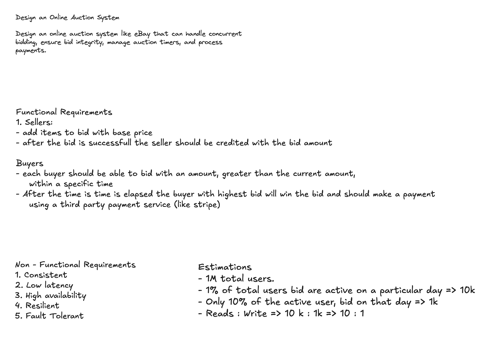

# Session 04 — Online Auction System (eBay-style) · ❌ 5.5/10

> A scored, analyzed system-design mock. This was the **first brand-new problem** since I re-did the e-commerce question twice (S02→S03), and it got my **lowest score yet**. That's exactly why it's worth reading: a topic I hadn't rehearsed took away my usual checklist and exposed two gaps I'd been hiding — **handling many bids at the same time** and **keeping shared data correct across servers**. Those two things happen to be the whole point of an auction system.

| | |
|---|---|
| **Problem** | Design an online auction system like eBay — concurrent bidding, bid integrity, auction timers, payments |
| **Focus** | Staying correct when many people bid at once, plus live updates for lots of viewers |
| **Overall** | **5.5 / 10** — ❌ Needs work (my first score below 5.5; the previous lowest was 5.9) |
| **Weakest areas** | Problem-Solving (5.0), Scale & Trade-offs (5.0) |
| **Full transcript** | [`script.md`](./script.md) (raw interview log) |

## The problem

> Design an **online auction system like eBay** that can handle **concurrent bidding**, ensure **bid integrity**, manage **auction timers**, and **process payments**.

Every part of that sentence is really a "stay correct when things happen at once" problem: *concurrent bidding* (many people writing to one item at once), *bid integrity* (the current highest bid must be right the moment it's written, not fixed up later), *auction timers* (close each auction once, exactly on time), and *payments* (move money reliably). In other words, the problem tests the exact two areas I scored lowest on.

## Requirements & estimation

- **Functional:** Sellers create auctions with a base (reserve) price and get credited after a successful sale; Buyers browse, then bid an amount **greater than the current** within a time window; the **highest bidder when the timer expires wins** and pays via a third party (Stripe).
- **Non-functional:** Consistent · Low latency · Highly available · Resilient · Fault tolerant. *(Correctly prioritized consistency given money is involved.)*
- **Estimation:** 1M total users · 1% active per day = **10k daily users** · 10% of them actually bid = **~1k bidders/day** · **reads outnumber writes about 10:1**.
  - **Gap:** those are big-picture averages, and they're small. I never worked out the number that actually matters — **the hot auction**: one popular item in its last few seconds pulls thousands of viewers at once and a rush of bids onto **a single database row**. That's the real scaling challenge, and I never put a number on it (no bids-per-second at the peak, no count of live viewer connections, no storage size).

> Despite the filename, `requirements-and-db.png` has **no data model** in it — just the requirements and estimation text. I still didn't draw the database tables (the same gap flagged in S01/S02).

## The design I produced

- **Services:** create-auction, bid, payment, plus a **bid scheduler** and a **reconcile-job**. Each service does one job — good.
- **APIs:** Seller — `POST /auction`, `GET /auctions`, `GET /auction/{id}`. Buyer — `GET /bids`, `GET /bid/{id}`, `POST /buy/{id}`.
- **Storage:** a SQL database (picked because money needs to stay consistent) + **S3** for item images behind a **CDN** + a **Redis** cache sitting between the service and the database.
- **Wallet idea:** buyers add money up front; I check they have enough **before** letting them bid (`balance ≥ bid`) and take it when they win. A genuinely smart safeguard — but I brought it up too late and never put it in the diagram.
- **Bidding (as I designed it):** save **every** bid in the database; when the timer ends, the scheduler picks the highest; then **run the auction again in rounds** (raise the floor and repeat, a **fixed ~5 rounds**).
- **Timer:** a **bid scheduler** runs each auction's life and moves it through the rounds.
- **Payment:** when an auction finishes, the scheduler calls the payment service → `POST /payment` to Stripe; a **reconcile-job** checks `GET /paymentStatus` and writes the result back with `POST /updateStatus`; it retries if something fails.
- **Live updates:** **SSE** for payment status (I drew this), and — after the interviewer nudged me — SSE for bid updates too (but I kept flip-flopping between SSE and polling).
- **Staying up during failures:** a **primary-replica** database with automatic failover (if the primary dies, a replica is promoted to take writes).

## Why this was the lowest score yet — three wrong ideas I walked in with

Almost all the lost points came from three wrong mental models, not from missing knowledge:

| What I believed in the room | Why it cost points | The correct idea |
|---|---|---|
| **An auction is several re-bidding rounds, fixed at ~5** (transcript L132, L144) | That's not how eBay works, and it made everything downstream fuzzy — the timer, who wins, and "when is it even over?". The interviewer asked 3 times (L141) and I never gave a clean answer. | An auction is **one auction with a single hard `end_time`**. Whoever is highest when the clock hits zero wins. No rounds. |
| **"Save all the bids and pick the highest after the timer ends"** (L132, L230) | This *skips* the actual requirement. "Bid integrity" and "bid must beat the current one" mean the current highest has to be right **the moment each bid is written** — you can't figure it out afterward. | Check "is this bigger than the current highest?" **as part of writing the bid**, in one place that handles bids one at a time. |
| **Keep the highest bid in the service's memory (a max-heap)** (L236–246) | Right instinct (find the highest fast), wrong place to keep it — it's lost if the server crashes, and if you run N copies of the service, each has its own heap and they disagree. I ended on "I'm not sure how to do that" (L246). | Keep it somewhere shared and durable: a **Redis sorted set (ZSET)** plus a **bids log you only ever add to**. |

## Scorecard

| Axis | S03 | **S04** | Δ |
|---|:--:|:--:|:--:|
| Requirements Gathering | 7.0 | **6.5** | ▼ 0.5 |
| Design Skills | 7.0 | **6.0** | ▼ 1.0 |
| Problem-Solving | 6.0 | **5.0** | ▼ 1.0 |
| Scalability & Trade-offs | 6.0 | **5.0** | ▼ 1.0 |
| Communication | 6.0 | **6.0** | — |
| **Overall** | 6.5 | **5.5** | ▼ 1.0 |

> The drop makes sense and it's useful. S02 and S03 were the *same* problem I'd already practiced, so my checklist carried me. This was a **new** problem whose core *is* handling concurrency and shared state — my two weak spots — with nothing rehearsed to fall back on. Requirements and Communication stayed about the same; the scores fell on the parts that need on-the-spot reasoning (Problem-Solving, Scale).

## What lost points — and the fix

| What I missed in the room | The answer a senior would give | Study |
|---|---|---|
| **Never said concretely how to handle bids at once** — I said "grab a lock" then switched to "save all bids, pick the max later" | Let the database enforce the rule in one step: `UPDATE auctions SET current_price=:bid, top_bidder=:u WHERE id=:a AND current_price < :bid`, then check whether a row actually changed — or route each auction's bids to a **single writer**. Know the three options (pessimistic lock, optimistic/version check, atomic conditional update) and pick one. | [Concurrency Control](../../concepts/08-distributed-systems/concurrency-control.md) |
| **Never solved sharing state across servers** — an in-memory max-heap is lost on a crash and differs on every server | Keep the highest bid in a **Redis ZSET** (shared by all servers, O(log n), acts as a live leaderboard); also save every bid to a durable log so you can rebuild it. | [Redis & Memcached](../../concepts/06-caching/redis-and-memcached.md) |
| **Kept flip-flopping between SSE and polling** — never picked one way to do live updates at scale | **Use SSE (server→client) on a set of stateless connection servers, with pub/sub to fan messages out.** Bids go over a normal `POST /bid`; only the price update needs to be pushed, so one-way SSE is enough (you'd only need WebSocket if the browser also had to push a lot). This splits "how many people are watching" from "how fast bids are written" — the exact bottleneck raised at L204. | [Real-time Communication](../../concepts/04-apis/realtime-communication.md) |
| **Treated the timer as fixed rounds; never covered what if the scheduler crashes / how to close only once** | One auction with a single `end_time`; a **delay queue** plus a guarded `OPEN→CLOSING→CLOSED` change so closing is **safe to run even if it fires twice**; add **anti-sniping** (a last-second bid extends the end time). | [Message Queue](../../concepts/07-messaging-and-events/message-queue.md) |
| **No Orders table** (same miss as S03) — nothing records *what was actually won* | When an auction closes, create an **`orders`** row (auction, winner, amount, item); the payment points at that order. A payment is not the same thing as an order. | [Databases](../../concepts/05-databases-and-storage/databases-fundamentals.md) |
| **Didn't touch payment security / PCI** (same miss again) | Let **Stripe hold the card details** (tokenize) — never store cards yourself; put an **idempotency key** on each charge so a retry can't bill twice. | [API Security](../../concepts/04-apis/api-security.md) |
| **Messy diagram** (same miss again) — arrows crossing everywhere | Draw read and write flows separately, color each user journey, and leave space between boxes. | — |
| **Estimation missed the hot auction** | Put real numbers on the **bids-per-second for one hot item** and the **number of viewers connected at once** — those size the write path and the fan-out layer, not the overall daily-user count. | [Estimation](../../concepts/01-envelope-estimation/back-of-the-envelope-estimation.md) |

## What went well

Even on an unfamiliar problem, the good instincts showed up: clean **splitting into services** (bid / auction / payment / reconcile), the **reconcile-job** as a safety net for failed payments, **checking the wallet balance before letting someone bid**, **primary-replica failover** to keep the database available, and the right call to **favor consistency over availability** for a money system — with a good reason: "better to reject a bid than accept a bad one."

---

## The ideal design

The whole system boils down to one sentence: **keep one item's highest bid correct during a rush, close the auction exactly once, and serve all the watchers cheaply.** Get that framing right and every smaller answer falls out of it.

### 1. Frame the scale correctly
The load that matters isn't the total requests per second — it's the **hot auction** (one item's final seconds: thousands of watchers and a burst of bids landing on one database row). That's a **hot-key** problem. Just saying this out loud reframes every decision that comes after.

**Split the consistency (the senior insight):**
- **Bid write path → CP (pick correctness).** Better to reject a bid than accept a wrong one.
- **Browse/watch path → AP (pick availability).** A price that's a second out of date is fine; the live layer fixes it a moment later.

### 2. Bid integrity under concurrency (the core)

| Approach | How | Trade-off |
|---|---|---|
| Pessimistic lock (`SELECT … FOR UPDATE`) | Lock the auction row per bid | Correct, simple; **serializes a hot item**, holds locks |
| Optimistic / version CAS | `UPDATE … WHERE version=? AND current < :bid` | Great at low contention; **retry storms** on a hot item |
| **Atomic conditional update** | `UPDATE auctions SET current_price=:bid, top_bidder=:u WHERE id=:a AND current_price < :bid` → check rows-affected | DB enforces the invariant in one statement — **the clean RDBMS answer** |
| **Per-auction single writer** (partition by `auction_id`) | Route all bids for an auction to one owner (queue/actor); process sequentially, keep highest in memory + append to a durable log | **Removes contention entirely**; scales hot items horizontally across auctions |

**The ideal answer, in two parts:**
- **Source of truth:** an append-only **`bids` log** (permanent, auditable — replay it to rebuild after a crash).
- **One writer per auction:** either the **atomic conditional UPDATE**, or a **single writer per auction** for hot items — this keeps `current_highest` correct. Mirror it into a **Redis ZSET** for the live leaderboard. (This is the "max-heap" idea done properly.)

### 3. Auction timer — close it exactly once
- **Don't poll every auction.** Use a **delay queue / time-bucketed scheduler** (a Redis ZSET keyed by `end_time`, or a timer service).
- **One worker closes it** via a **guarded transition** `OPEN → CLOSING → CLOSED` — so even if two workers fire, the close happens only once (that's "idempotent").
- **At close:** read the highest bid → if `≥ reserve_price`, create the Order and emit `AuctionClosed`; else mark it unsold.
- **Anti-sniping (soft close):** a bid in the last few seconds pushes `end_time` out, so nobody wins by sniping at the last instant.

### 4. Real-time fan-out (settling SSE vs polling)
- **Watchers connect over SSE** — a stateless connection tier, each browser subscribed to a **channel per auction** (one-way server→browser).
- **Bid writer publishes** each new highest bid to **pub/sub** (Redis Pub/Sub or Kafka); connection servers push it out.
- **Why this matters:** it **separates bidders from watchers** — a celebrity auction just needs more *connection servers + pub/sub*, not a bigger database.
- **Why SSE, not WebSocket:** bids go over a normal `POST /bid`, so only the price *push* needs an always-open connection. SSE does exactly that + auto-reconnects (`Last-Event-ID`) over plain HTTP. WebSocket only pays off when the *client* also sends a lot (chat, collab-editing) — not here.
- *Caveat:* HTTP/1.1 allows only ~6 connections per domain; HTTP/2 multiplexing removes that limit.

### 5. Payments + the Orders model I forgot
- **On close:** create an **`orders`** row → charge via **Stripe with tokenization** (card data never touches our servers — that's PCI) + an **idempotency key** (a retry never double-charges).
- **Payment states:** `PENDING → AUTHORIZED → CAPTURED / FAILED`; a **webhook** confirms, and the **reconciliation job** is the backstop if the webhook never arrives.
- **If the winner doesn't pay:** retry with backoff → then **offer to the runner-up** or relist.
- *Simplification:* a wallet/escrow model (pre-funded money, no authorize-then-capture) is fine — just flag it as a deliberate scope cut.

### 6. Architecture at a glance

![Ideal auction architecture with five color-coded flows — a bidder posts through the API gateway to the write path where the bid service is a single writer per auction, guarding the invariant on the auctions DB with an atomic conditional update and appending to a durable bids log in the same transaction; only after the DB acks does the bid service update the Redis ZSET leaderboard and write-through the new price to the read cache, then publish to pub/sub; the real-time fan-out tier of pub/sub plus a stateless SSE connection tier pushes live updates to watchers; the read path serves browse traffic from a Redis cache and read replicas fed by async replication; a timer scheduler closes auctions exactly once and creates orders; and a payment service charges Stripe with an idempotency key backed by a reconciliation job](./diagrams/ideal-design.png)

| Layer | Component | Store |
|---|---|---|
| Edge | CDN (item images), API Gateway (authN/Z, **rate limiting** for bid spam) | Object store (S3) |
| Read path | Auction/browse service | RDBMS **read replicas** + Redis cache |
| Write path | **Bid service** (serialized per auction) | RDBMS `auctions`/`bids` + Redis ZSET |
| Real-time | Connection tier (**SSE**, server→client) + **pub/sub** | Redis Pub/Sub / Kafka |
| Lifecycle | **Timer/scheduler** (exactly-once close) | Durable delay queue |
| Money | Payment service + reconciliation | RDBMS `orders`/`payments` |

### 6.1 The whole flow in plain language (read + write)

Picture a packed auction room: **most people are just watching** the price tick up, only a **few are bidding**. The design splits those two crowds into separate flows on purpose.

**Write flow — a bid happens (the red path):**

1. **Bidder bids.** Browser sends `POST /bid` → **API Gateway** (checks identity, rate-limits spam) → **Bid Service**.
2. **Bid Service is the sole referee for that auction.** In **one PostgreSQL transaction** (both succeed or both fail):
   - **(a) atomic conditional UPDATE** — *"set the price to this bid, but only if it's higher"*. If it isn't higher, the bid is rejected — so two people bidding in the same millisecond can't both win; the DB decides.
   - **(b) append to the bids log** (the **`bids` table** — "bids log" is just its role name, an append-only log; same store, not a second one) — a permanent receipt of every accepted bid.
   - One transaction ⇒ no window where the price moved but the bid went unrecorded (or vice-versa).
3. **DB commits and acks — *then* refresh the fast copies.** Only **after** the ack does the Bid Service update the derived views: the **Redis ZSET** (live leaderboard) and the **Redis read cache** (`SET auction:123:price = 5000`).
   - **Order matters: DB → ack → copies.** The source of truth updates first, so no copy can ever show a price the DB rejected. (Updating the ZSET *before* commit would be a bug — a rollback would leave a phantom bid on the board.)
   - ZSET + cache live outside the transaction, so each is **best-effort with retry**. This is what closes the *stale-base-price* hole — they're part of the write fan-out, not passive TTL artifacts.
4. **Referee announces the price.** Bid Service publishes *"auction 123 → new highest ₹5,000"* to **Pub/Sub** (Redis Pub/Sub or Kafka) — a **PA system**: said once, doesn't care who's listening.
5. **Connection tier is listening** on that channel → pushes it down every open **SSE** pipe for a browser watching auction 123.
6. **Every watcher's screen updates** — price ticks up, no refresh needed.

**Read flow — someone opens the page (the blue path):**

- A **first page load** does **not** touch the real-time channel or the Bid Service.
- `GET /auction/{id}` → API Gateway → **Auction/Browse Service** → **Redis cache** (hit → return); on a **miss**, fall through to a **read replica** (async-replicated) and warm the cache.
- **Images** come straight from the **CDN**, never the origin.
- So the initial snapshot (price, details, images) is served entirely off the cheap, horizontally-scalable read path — then the SSE channel keeps it live.
- Read path is **AP** (a price stale by a second is fine; the next SSE push fixes it); only the bid write path is **CP**.

**Keeping the cache honest (invalidation):**

- **The trap:** cache holds `base_price`, a bid makes the truth `base_price + 1`, but plain cache-aside only re-reads on TTL → serves the stale number for seconds.
- **The fix:** **write-through-after-ack** — the Bid Service updates the price key on *every* accepted bid, right after commit, so the cache is never stale by more than one write.
- **Two backstops:** (1) a **short TTL** self-heals if a write-through is ever dropped; (2) the **SSE push** keeps already-open pages live regardless of cache — so staleness only ever hits a brand-new first load, for a moment.
- Cache and DB writes **aren't one transaction**: if the cache write fails after commit, **retry with backoff** and lean on TTL + SSE — the AP read path degrading gracefully, by design.

> **The one insight this buys you:** *watching* is fully decoupled from *bidding*. A celebrity auction with 50,000 watchers adds **zero** load to the Bid Service or write DB — the bid still happens once and is announced once. You absorb the 50,000 with more **connection servers + read replicas**, never by touching the serialization point.

**Analogy for the room:** Bid Service = the **auctioneer** (only one, settles who's highest) · Pub/Sub = the **PA system** (announces once) · Connection tier = the **loudspeakers on every wall** (carry it to all 50,000 ears) · Read path = the **printed catalog** at the door (what you read before the action). More listeners → more loudspeakers, not more auctioneers.

### 7. Data model (the still-missing artifact)

| Table | Fields | Note |
|---|---|---|
| items | id, title, description, image_urls | |
| auctions | id, seller_id, item_id, start_time, end_time, base_price, reserve_price, **current_bid_id**, **status**, **version** | status ∈ `OPEN / CLOSING / CLOSED`; version for CAS |
| bids (= the "bids log") | id, auction_id, bidder_id, amount, created_at | **append-only source of truth**; index `(auction_id, amount desc)` |
| orders | id, auction_id, winner_id, amount, status | records *what was won* |
| payments | id, order_id, provider_ref, status, **idempotency_key** | tokenized via Stripe |

## Takeaways to drill

1. **Handling many things at once is now my confirmed #1 weakness** — I missed it in S02/S03 as a small *edge case*, and here it was the *whole problem* and I still couldn't make it concrete. I need to be able to say the atomic-conditional-update / one-writer-per-auction answer without hesitating.
2. **Shared state across servers lives in Redis, not in one process's memory** — any time I need to "track the highest/latest X across many servers," it needs a shared store (a ZSET) plus a durable log, never a variable inside one process.
3. **Pick one real-time approach and stick with it** — always-open connections + pub/sub fan-out. Stop flip-flopping back to polling when I feel pressure.
4. **Schedulers must act exactly once** — a guarded status change so the close can't happen twice. Always ask "what if the scheduler crashes halfway through?"
5. **Understand the domain before designing the mechanism** — my "fixed rounds" detour came from not knowing how an auction actually ends. It's simple: one `end_time`, highest bid wins.
6. **Orders and Payments are different things, and card data means PCI** — still the two boxes I silently skip, now three sessions in a row.

→ Consolidated feedback across all sessions lives in the [practice tracker](../README.md). Rehearse with the [Opening Ritual](../opening-ritual.md) + [Answer Framework](../answer-framework.md) before the next mock.
