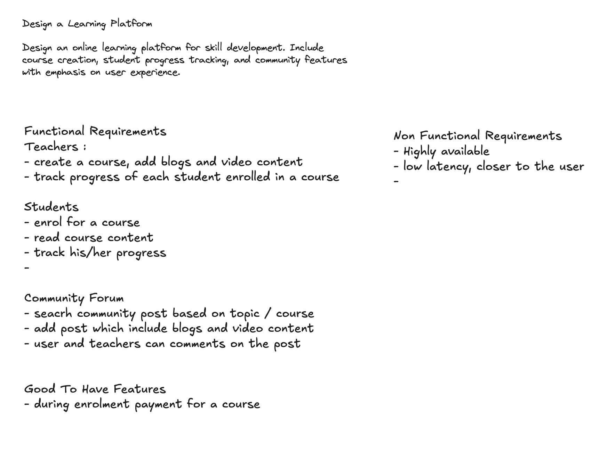

# Session 05 — Online Learning Platform (Udemy/Coursera-style) · ⚠️ 6.5/10

> A scored, analyzed system-design mock. After the S04 auction score (5.5, my lowest), this was a **rebound to 6.5 — Lean Hire / Borderline**. The good instincts I've been drilling all showed up *unprompted* this time: **CQRS** (split read/write services), **event-driven progress tracking**, **cache-aside + invalidation**, **CDN for video**, and a clean **read-your-writes** answer for replication lag. What still held me back is the *same* short-list I keep seeing — **no capacity numbers, no data model** — plus one domain-specific miss: I never explained **how video streaming actually works** (transcoding + adaptive bitrate), which is the heart of a learning platform.

| | |
|---|---|
| **Problem** | Design an online learning platform — course creation, video content, student progress tracking, community forum, with emphasis on UX |
| **Focus** | Read-heavy content delivery (video), progress tracking, community features |
| **Overall** | **6.5 / 10** — ⚠️ Borderline (Lean Hire) — up 1.0 from S04's 5.5 |
| **Weakest areas** | Problem-Solving (6.0), Communication (6.0) |
| **Full transcript** | [`script.md`](./script.md) (raw interview log) |

## The problem

> Design an **online learning platform for skill development**. Include **course creation**, **student progress tracking**, and **community features**, with emphasis on **user experience**.

Three sub-systems hide in that sentence, each with a different shape: **course creation + delivery** is a *video pipeline* problem (upload → transcode → stream to millions cheaply); **progress tracking** is a *many-small-writes* problem (every lesson-completion is a write, and the student must see it instantly); and the **community forum** is a *read-heavy social + search* problem. "Emphasis on UX" is the interviewer's hint that **latency and freshness** (fast video start, progress that updates immediately) are the graded qualities.

## Requirements & estimation

- **Functional** — three roles:
  - **Teachers:** create a course; add blog + video content; track the progress of each enrolled student.
  - **Students:** enrol in a course; read/watch content; track their own progress.
  - **Community forum (open to all):** search posts by topic/course; create posts (blogs + video); teachers and students comment on posts.
  - **Good-to-have:** payment during enrolment *(scoped out — assumed all courses free for this session).*
- **Non-functional:** Highly available · Low latency (content served close to the user).
- **Estimation:** **none produced.** No DAU/concurrent users, no read:write ratio, no video storage/bandwidth sizing.
  - **Gap (recurring):** for a video platform, storage and egress bandwidth are the numbers that pick the architecture — they're *why* you reach for S3 + CDN + transcoding. I named the components but never sized them, so the "why" stayed implicit. (Same estimation miss as S01 and S04.)

## The design I produced

![Learning-platform architecture — student and teacher clients through two stacked API gateways (authN/Z + rate limiting) into six services: Create/Enrol Course, Video Processing, Read Course, Community Forum Read, Community Forum Write, and Analytics. Read Course Service fires progress events into a Kafka broker consumed by Analytics. Video Processing chunks uploads into AWS S3; a CDN fronts video reads to the student. Separate Course and Forum databases each have a primary writer plus reader replicas, with a cache in front of each. Color-coded per journey (teacher green, student read red, forum blue) but several flows cross and the CDN sits unconnected to the video read path](./diagrams/architecture.png)

- **Clients & edge:** student client + teacher client → **API Gateway** (authN/Z, rate limiting) → services. Correctly called the gateway and all services **stateless → horizontally scalable**.
- **Services (CQRS split):** `Create/Enrol Course`, `Video Processing`, `Read Course`, `Community Forum Read`, `Community Forum Write`, `Analytics` — each doing one job, reads split from writes.
- **Teacher (write) flow:** `POST /course` → Create Course Service → writes course metadata to the **Course DB (primary)**; then `POST /uploadVideo/{course-id}` → Video Processing Service **chunks the video → AWS S3**, saving each chunk's S3 path to the DB.
- **Student (read) flow:** `GET /course/{id}` / `GET /video/{id}` → Read Course Service → fetches metadata from a **read replica** + video from **S3**; a **CDN** caches video closer to the user (lower latency, cheaper, less origin load).
- **Progress tracking:** each read fires an **event → Kafka → Analytics Service**, which tracks per-student progress. For lag, proposed **client-side optimistic updates** (bump the % locally while the backend catches up).
- **Community forum:** separate `Read`/`Write` services on their **own database** (separation of concerns, independent scaling); APIs `POST /content`, `GET /contents`, `GET /content/{id}`. Search: start with **heading match**, evolve to **AWS Elasticsearch** for deep search.
- **Scale & consistency:** **cache-aside** (lazy load) in front of both DBs with **invalidation on write**; **read replicas**; **read-your-writes** so a teacher sees a just-created course immediately, accepting a few-minutes eventual-consistency window for other students ("don't over-engineer").

## Scorecard

| Axis | S04 | **S05** | Δ |
|---|:--:|:--:|:--:|
| Requirements Gathering | 6.5 | **7.0** | ▲ 0.5 |
| Design Skills | 6.0 | **7.0** | ▲ 1.0 |
| Problem-Solving | 5.0 | **6.0** | ▲ 1.0 |
| Scalability & Trade-offs | 5.0 | **7.0** | ▲ 2.0 |
| Communication | 6.0 | **6.0** | — |
| **Overall** | 5.5 | **6.5** | ▲ 1.0 |

> The rebound is real and it's the drilled instincts paying off: CQRS, event-driven tracking, caching + invalidation, CDN, and a crisp read-your-writes answer all appeared *without prompting*. **Scale jumped +2.0** because I reasoned about the read-heavy bottleneck (cache + CDN + replicas) confidently. What kept it at Lean Hire, not Hire: **estimation and schema still missing**, plus **needing prompts** to reach edge cases (replication lag, stale cache) and shallow depth on **video streaming and search** — the two components most specific to this problem.

## What lost points — and the fix

| What I missed in the room | The answer a senior would give | Study |
|---|---|---|
| **No capacity estimation** (recurring: S01, S04) — named S3/CDN/replicas but never sized them | For video, the sizing *is* the argument: e.g. 10k courses × 5 hrs × ~1 GB/hr ≈ **50 TB** source, ×~4 for transcoded renditions → **object store, not a DB**; peak concurrent streams × ~5 Mbps → **Gbps of egress → CDN offload is mandatory, not optional**. State DAU, concurrent streams, read:write, storage, bandwidth. | [Estimation](../../concepts/01-envelope-estimation/back-of-the-envelope-estimation.md) |
| **No data model / schema** (recurring: S01, S02, S04) — the interviewer explicitly noted it at the end | Draw the tables: `users`, `courses`, `lessons`, `enrollments`, **`progress` (user_id, lesson_id, position, completed)**, `posts`, `comments`. The progress table is the crux of the whole problem. | [Databases](../../concepts/05-databases-and-storage/databases-fundamentals.md) |
| **Video streaming was never explained end-to-end** — "chunk it into S3" skips the actual mechanism | Upload → **transcode to multiple bitrates** (1080p/720p/480p) → **segment into HLS/DASH** (`.m3u8` + `.ts` chunks) → S3 → CDN; the player does **adaptive bitrate** (picks a rendition per the viewer's bandwidth). *That* is why you chunk — not just to store. | [Object / Blob Storage](../../concepts/05-databases-and-storage/object-blob-storage.md) · [CDN](../../concepts/03-networking-and-delivery/cdn.md) |
| **Progress modeled as a Kafka read-event → Analytics** — so the student's own progress is eventually consistent, then patched with client-side optimism | Progress is **user-facing state**, not analytics. Write it directly as an **idempotent upsert** (`progress(user, lesson) → position`) so the student always reads their true state; fan a *copy* to Kafka for the teacher's dashboard / analytics. Don't derive authoritative state from a lossy analytics stream. | [Concurrency Control](../../concepts/08-distributed-systems/concurrency-control.md) |
| **CDN drawn but not wired into the video read path** (echo of S02/S04 diagram notes) | The read arrow for video should go **client → CDN → (miss) → S3**, not client → service → S3. Draw the CDN *on* the path it accelerates. | [CDN](../../concepts/03-networking-and-delivery/cdn.md) |
| **Search left shallow** — "heading match now, Elasticsearch later" with no indexing detail | Say how the index stays current: **CDC / dual-write from the posts DB → Elasticsearch**, index title + body + tags, query with relevance ranking. Name the inverted-index idea. | [Full-Text Search](../../concepts/05-databases-and-storage/full-text-search.md) |
| **Community forum not linked to courses** — it floated as a standalone system | Tag posts with an optional `course_id` so a course page can show its own discussion thread — that's the "community feature" the prompt actually wants, and it costs one foreign key. | — |
| **Needed prompting for edge cases** — replication lag and stale cache only came up when asked | Raise them proactively: "reads hit replicas, so there's lag — I'll use read-your-writes for the author and accept seconds of staleness for others; on a course update I invalidate the cache." Same content, but *self-driven* is the senior signal. | [Consistency Models](../../concepts/08-distributed-systems/consistency-models.md) |

## What went well

The habits I've been drilling landed *unprompted* this time — this is the progress signal:

- **CQRS instinct** — split read/write services for both courses and the forum, and defended the trade-off (independent scaling vs. operational overhead) cleanly.
- **Event-driven progress tracking** with Kafka, and correctly reasoned about **consumer durability** (replication, offset-based replay so no event is lost) when pushed on failure.
- **Read-heavy scaling reflexes** — cache-aside + **invalidation on write**, read replicas, CDN for video, stateless services → horizontal scale. This is what drove Scale from 5.0 → 7.0.
- **Read-your-writes** for the teacher who just published, with a pragmatic "don't over-engineer the ~1s replica lag for everyone else" — good judgment, well argued.
- **Separation of concerns** for the forum DB, justified by independent scaling and blast-radius isolation.

---

## The ideal design

**The crux:** a learning platform is a **video-delivery problem wearing a CRUD app's clothes** — the hard, graded parts are *streaming video cheaply to many* and *making a student's own progress feel instant*; course/forum CRUD is the easy scaffolding around them. Everything below follows from that one framing.

### 1. Ideal estimation (the numbers I skipped)

The point of estimating here is to prove that **video dominates storage + bandwidth** while everything else is cheap CRUD — that single split justifies S3, the CDN, and the transcoding pipeline.

| Quantity | Assumption | Result | Decision it forces |
|---|---|---|---|
| Users | 10M registered · 1% DAU | **100k DAU** | replicas + cache, not one box |
| Read : write | mostly watching/reading | **~100 : 1** | CQRS split, read replicas |
| **Video storage** | 10k courses × 5 hr × ~1 GB/hr = 50 TB source, ×4 renditions | **~200 TB** | **object store (S3), never a DB** |
| **Video egress** | ~10k concurrent streams × 5 Mbps | **~50 Gbps peak** | **CDN must absorb ~95%+ of bytes** |
| Progress writes | 100k DAU × ~20 pings/day ÷ 10⁵ s, peak 2× | **~20/s avg, ~40/s peak** | trivial for one RDBMS + idempotent upsert |
| Metadata + forum | small rows, read-heavy | fits RDBMS + Redis | cache-aside, no exotic store |

> The takeaway said out loud: **the scale story is the video bytes, not the request count.** Progress writes are a rounding error; the money is in egress → CDN offload is mandatory, not optional.

### 2. Requirements — the ideal cut

- **Functional (in scope):** teachers create courses + upload video; students enrol, stream video, and **track their own progress**; a community forum (posts + comments) **searchable** and **linkable to a course**.
- **Deliberately out of scope (name them, then cut):** payments/checkout, quizzes & grading, certificates, live classes. Flag each as a scope cut so the interviewer knows it's a choice, not a miss.
- **Non-functional (ranked):** **low latency** (fast video start, *instant* own-progress) → **high availability** for the read path → **durability** of content + progress → **consistency split per path** (see §9): progress write is read-your-own-writes; browse/watch is AP.

### 3. Ideal architecture

Read and write flows are drawn separately on purpose — the whole design rests on **decoupling the cheap-and-huge read path (video) from the small, correctness-sensitive write path (progress, course metadata)**.

![Ideal learning-platform architecture as a Mermaid flowchart with the write path and read path in separate labeled clusters. Teachers upload raw video via a pre-signed URL straight to AWS S3, which emits an upload event to a transcode queue whose workers produce bitrate renditions and HLS or DASH segments back into S3. Course and progress writes go through the API gateway to the Course/Enrol Service and the Progress Service, which does an idempotent upsert into a progress store and emits an event to Kafka for the analytics dashboards. The read path serves video from the CDN with S3 as origin on a miss, and course metadata from the Read Course Service backed by a Redis cache that falls through to an asynchronously replicated Course DB read replica. The forum has separate write and read services over a forum database, with change data capture feeding Elasticsearch for search](./diagrams/ideal-design.png)

| Layer | Component | Store |
|---|---|---|
| Edge | **CDN** (video segments + images), API Gateway (authN/Z, rate limiting) | AWS S3 origin |
| Video write | Upload (pre-signed URL) → queue → **transcode + segment (HLS/DASH)** workers | AWS S3 + job queue |
| Read path | Read Course service, Forum Read service | RDBMS **read replicas** + Redis cache |
| Write path | Course/Enrol service, Forum Write service, **Progress service (idempotent upsert)** | RDBMS (`courses`, `enrollments`, `progress`, `posts`) |
| Analytics | Kafka → Analytics/aggregation (teacher dashboards) | OLAP / warehouse |
| Search | CDC → **Elasticsearch** | Inverted index |

### 4. The video pipeline (the component that makes it a *video* platform)

This is the depth the session missed. Upload is a **write-once, read-many** flow, done **asynchronously**:

1. Teacher uploads the raw file → object store (a **pre-signed S3 URL**, so bytes bypass your servers).
2. Upload event → queue → **transcoding workers** produce multiple **bitrate renditions** (1080p/720p/480p).
3. Each rendition is **segmented for adaptive streaming** — **HLS/DASH**: a manifest (`.m3u8`/`.mpd`) + short **`.ts`/`.m4s` segments**.
4. Segments land in S3; the **CDN** fronts them.
5. Playback: the client fetches the manifest, then **adaptive bitrate (ABR)** picks a rendition per segment based on the viewer's live bandwidth — smooth start, no buffering on a weak connection.

> *That's the real reason to "chunk" a video* — segments enable ABR + CDN caching, not just storage. Naming HLS/DASH + ABR is the senior signal here.

### 5. Progress tracking — make it feel instant *and* be correct

The key distinction the session blurred: **a student's own progress is user-facing state; analytics is derived.** Two separate paths:

- **Authoritative write:** `PUT /progress {course, lesson, position}` → **idempotent upsert** into a `progress` table (unique on `(user_id, lesson_id)`). The student reads their true state instantly — no lag, no client-side guessing.
- **Derived stream:** emit the same event to **Kafka** → Analytics builds the teacher's dashboard and course-completion aggregates. If this lags, only *analytics* is stale — never the student's own bar.

This is the [source-of-truth vs. derived-view](../../concepts/08-distributed-systems/concurrency-control.md) idea: don't reconstruct authoritative state from a lossy analytics pipeline.

### 6. Content delivery & caching

- **Video** → CDN → S3. **Course metadata / forum reads** → Redis **cache-aside** with **invalidation on write**; a short TTL is the self-healing backstop.
- **Read replicas** for both DBs; **read-your-writes** (route the author's immediate read to primary) so a just-published course/post appears at once; accept seconds of eventual consistency for everyone else.

### 7. Community forum + search

- Posts + comments in their own DB; **tag posts with an optional `course_id`** so course pages carry their own discussion (the actual "community feature").
- **Search:** stream posts (and course titles) into **Elasticsearch** via **CDC / dual-write**; index title + body + tags; query with relevance ranking. Start with a DB `LIKE` only if explicitly de-scoping.

### 8. Database schema (the still-missing artifact)

| Table | Fields | Note |
|---|---|---|
| users | id, name, role (`teacher`/`student`) | one table, role flag |
| courses | id, teacher_id, title, description, status | `status ∈ draft/published` |
| lessons | id, course_id, title, video_id, order | ordered within a course |
| videos | id, lesson_id, s3_manifest_url, duration, status | `status`: `processing`/`ready` |
| enrollments | id, student_id, course_id, enrolled_at | who's in what |
| **progress** | **(student_id, lesson_id)**, position, completed, updated_at | **upsert target; the crux table** |
| posts | id, author_id, **course_id (nullable)**, title, body, created_at | `course_id` links forum ↔ course |
| comments | id, post_id, author_id, body, created_at | |

### 9. Design trade-offs

The senior signal is naming the alternative and *why* you didn't take it.

| Decision | Alternatives | Why this choice |
|---|---|---|
| **Video → S3 + CDN**, path served edge-first | Serve from app servers / store blobs in DB | 200 TB + 50 Gbps egress: only object store + CDN is affordable; a DB would melt |
| **CQRS** — split read vs write services | One service per domain | 100:1 read:write — scale reads (replicas, cache) independently of writes; cost is operational overhead |
| **Progress = direct idempotent write**, analytics derived from it | Derive progress from the Kafka/analytics stream (what I did in the room) | User-facing state must be instant + correct; deriving it from a lossy stream makes the student's own bar eventually consistent |
| **Split consistency per path** — write CP, browse/watch AP | One consistency level everywhere | Progress/course-publish need read-your-writes; a *view count* stale by a second is fine — matching each path to its need is cheaper than global strong consistency |
| **Async transcode via queue** | Transcode inline on upload | Upload returns immediately; transcoding is minutes-long and bursty — a queue absorbs the spikes and retries failures |
| **Elasticsearch** fed by CDC | DB `LIKE` / full-text column | Relevance ranking + scale for forum search; keep the DB as source of truth and treat ES as a rebuildable index |
| **Read-your-writes** for the author only | Route *all* reads to primary | Author sees their publish instantly; everyone else tolerates ~1s replica lag — don't over-engineer global freshness |

## Takeaways to drill

1. **Estimation is still not automatic — this is the clearest recurring gap (S01, S04, S05).** For any content platform, open with storage + egress numbers; they *are* the argument for S3 + CDN + transcoding. Make sizing a reflex, not an afterthought.
2. **Always draw the schema** — noted by the interviewer *again*. For this problem the `progress` table (unique on `(student, lesson)`, upserted) is the single most important box, and I never drew it.
3. **Know the video pipeline cold** — upload (pre-signed URL) → transcode to renditions → segment (HLS/DASH) → CDN → adaptive bitrate. This is the domain depth that separates Lean Hire from Hire on a media problem.
4. **Separate user-facing state from analytics** — a student's own progress must be a direct idempotent write, not something reconstructed from a lossy Kafka→analytics stream. Derive dashboards *from* the truth; never make the truth depend on the derivation.
5. **Be proactive on edge cases** — I had the right answers for replication lag and stale cache, but only *after* being asked. Volunteer "here's the consistency risk and my mitigation" before the interviewer digs.
6. **Wire every box you draw** — the CDN sat unconnected to the video read path. An unconnected component reads as "named but not understood."

→ Consolidated feedback across all sessions lives in the [practice tracker](../README.md). Rehearse with the [Opening Ritual](../opening-ritual.md) + [Answer Framework](../answer-framework.md) before the next mock.
